# Banana Slides 功能执行流程文档

本文档详细说明 Banana Slides 系统的各功能执行流程，帮助开发者理解从前端 UI 到后端服务再到 AI 模型的完整数据流。

---

## 目录

- [1. 项目概述](#1-项目概述)
  - [1.1 技术架构总览](#11-技术架构总览)
  - [1.2 核心模块说明](#12-核心模块说明)
  - [1.3 数据流向概览](#13-数据流向概览)
- [2. 核心功能流程](#2-核心功能流程)
  - [2.1 项目创建流程](#21-项目创建流程)
  - [2.2 大纲生成流程](#22-大纲生成流程)
  - [2.3 页面描述生成流程](#23-页面描述生成流程)
  - [2.4 图片生成流程](#24-图片生成流程)
  - [2.5 图片编辑流程（Vibe 式修改）](#25-图片编辑流程vibe-式修改)
  - [2.6 文件解析流程（PDF/Docx 等）](#26-文件解析流程pdfdocx-等)
  - [2.7 导出流程（PPTX/PDF/视频）](#27-导出流程pptxpdf视频)
  - [2.8 素材管理流程](#28-素材管理流程)
  - [2.9 PPT 翻新流程](#29-ppt-翻新流程)
  - [2.10 旁白生成流程](#210-旁白生成流程)
- [3. 跨模块机制](#3-跨模块机制)
  - [3.1 任务管理系统](#31-任务管理系统)
  - [3.2 错误处理与重试](#32-错误处理与重试)
  - [3.3 资源限制与并发控制](#33-资源限制与并发控制)
  - [3.4 参考文件系统](#34-参考文件系统)
  - [3.5 AI Provider 抽象层](#35-ai-provider-抽象层)

---

## 1. 项目概述

### 1.1 技术架构总览

Banana Slides 采用前后端分离架构，通过 AI 模型实现 PPT 自动生成。

#### 系统架构图

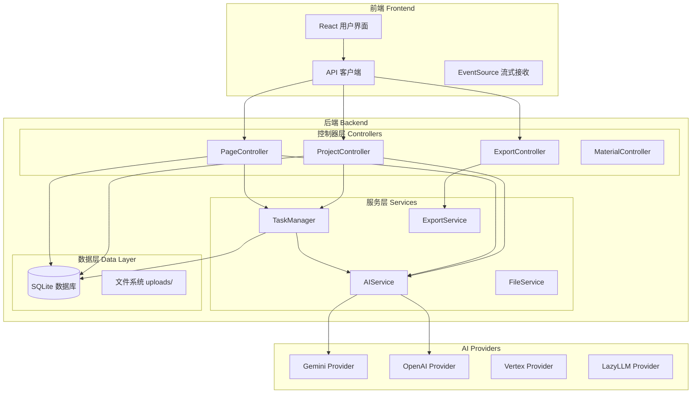
```mermaid
graph TB
    subgraph "前端 Frontend"
        UI[React 用户界面]
        API[API 客户端]
        SSE[EventSource 流式接收]
    end
    
    subgraph "后端 Backend"
        subgraph "控制器层 Controllers"
            PC[ProjectController]
            PaC[PageController]
            EC[ExportController]
            MC[MaterialController]
        end
        
        subgraph "服务层 Services"
            AIS[AIService]
            TM[TaskManager]
            FS[FileService]
            ES[ExportService]
        end
        
        subgraph "数据层 Data Layer"
            DB[(SQLite 数据库)]
            FS2[文件系统 uploads/]
        end
    end
    
    subgraph "AI Providers"
        GP[Gemini Provider]
        OP[OpenAI Provider]
        VP[Vertex Provider]
        LP[LazyLLM Provider]
    end
    
    UI --> API
    API --> PC
    API --> PaC
    API --> EC
    
    PC --> AIS
    PC --> TM
    PaC --> AIS
    PaC --> TM
    EC --> ES
    
    AIS --> GP
    AIS --> OP
    TM --> AIS
    
    PC --> DB
    PaC --> DB
    TM --> DB
```

#### 技术栈

**前端：**
- React 18 + TypeScript
- Vite 5（构建工具）
- Zustand（状态管理）
- TailwindCSS（样式）

**后端：**
- Python 3.10+
- Flask 3.0（Web 框架）
- SQLAlchemy（ORM）
- ThreadPoolExecutor（异步任务）

**AI Provider：**
- Gemini（Google）
- OpenAI
- Vertex AI
- LazyLLM（国内厂商聚合）

**数据存储：**
- SQLite（数据库）
- 文件系统（uploads/）

---

### 1.2 核心模块说明

#### 前端核心模块

| 模块 | 说明 | 代码位置 |
|-----|------|---------|
| API 客户端 | 封装所有后端 API 调用 | [frontend/src/api/endpoints.ts](../../vendors/banana-slides/frontend/src/api/endpoints.ts) |
| 状态管理 | Zustand stores | [frontend/src/store/](../../vendors/banana-slides/frontend/src/store/) |
| 创建项目 | 首页（项目创建入口） | [frontend/src/pages/Home.tsx](../../vendors/banana-slides/frontend/src/pages/Home.tsx) |
| 大纲编辑 | 大纲展示和编辑 | [frontend/src/pages/OutlineEditor.tsx](../../vendors/banana-slides/frontend/src/pages/OutlineEditor.tsx) |
| 详情编辑页 | 图片展示与 Vibe 式编辑 | [frontend/src/pages/DetailEditor.tsx](../../vendors/banana-slides/frontend/src/pages/DetailEditor.tsx) |

#### 后端核心模块

| 模块 | 说明 | 代码位置 |
|-----|------|---------|
| **ProjectController** | 项目管理 API | [backend/controllers/project_controller.py](../../vendors/banana-slides/backend/controllers/project_controller.py) |
| **PageController** | 页面管理 API | [backend/controllers/page_controller.py](../../vendors/banana-slides/backend/controllers/page_controller.py) |
| **ExportController** | 导出功能 API | [backend/controllers/export_controller.py](../../vendors/banana-slides/backend/controllers/export_controller.py) |
| **MaterialController** | 素材管理 API | [backend/controllers/material_controller.py](../../vendors/banana-slides/backend/controllers/material_controller.py) |
| **AIService** | AI 服务核心 | [backend/services/ai_service.py](../../vendors/banana-slides/backend/services/ai_service.py) |
| **TaskManager** | 异步任务管理 | [backend/services/task_manager.py](../../vendors/banana-slides/backend/services/task_manager.py) |
| **FileService** | 文件服务 | [backend/services/file_service.py](../../vendors/banana-slides/backend/services/file_service.py) |
| **ExportService** | 导出服务 | [backend/services/export_service.py](../../vendors/banana-slides/backend/services/export_service.py) |

#### 数据模型

| 模型 | 说明 | 代码位置 |
|-----|------|---------|
| **Project** | 项目数据模型 | [backend/models/project.py](../../vendors/banana-slides/backend/models/project.py) |
| **Page** | 页面数据模型 | [backend/models/page.py](../../vendors/banana-slides/backend/models/page.py) |
| **Material** | 素材数据模型 | [backend/models/material.py](../../vendors/banana-slides/backend/models/material.py) |
| **ReferenceFile** | 参考文件模型 | [backend/models/reference_file.py](../../vendors/banana-slides/backend/models/reference_file.py) |
| **Task** | 任务数据模型 | [backend/models/task.py](../../vendors/banana-slides/backend/models/task.py) |
| **PageImageVersion** | 图片版本模型 | [backend/models/page.py](../../vendors/banana-slides/backend/models/page.py) |

---

### 1.3 数据流向概览

#### 创作流程总体数据流

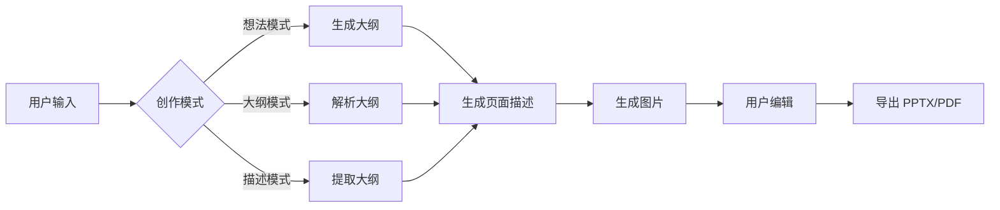
```mermaid
flowchart LR
    A[用户输入] --> B{创作模式}
    B -->|想法模式| C[生成大纲]
    B -->|大纲模式| D[解析大纲]
    B -->|描述模式| E[提取大纲]
    
    C --> F[生成页面描述]
    D --> F
    E --> F
    
    F --> G[生成图片]
    G --> H[用户编辑]
    H --> I[导出 PPTX/PDF]
```

#### 前端到后端的数据流

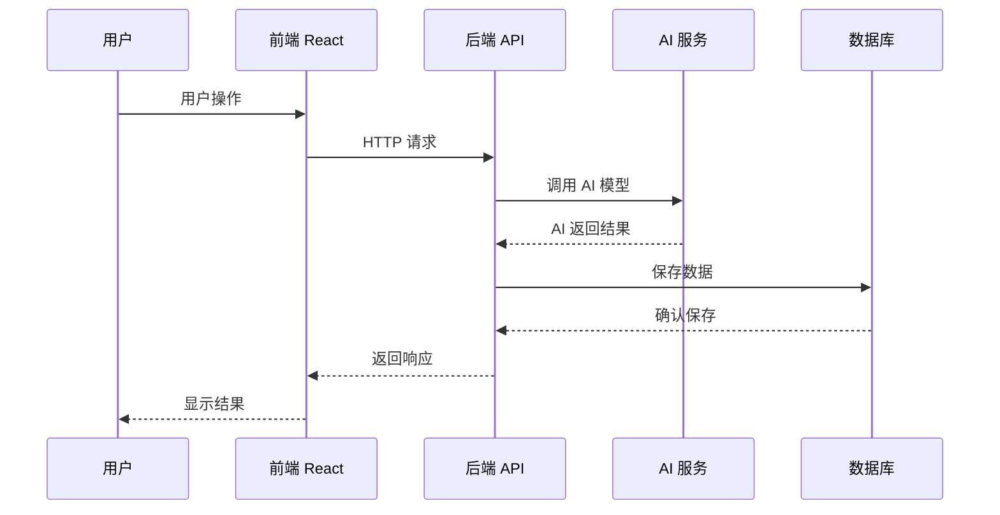
```mermaid
sequenceDiagram
    participant U as 用户
    participant F as 前端 React
    participant API as 后端 API
    participant AI as AI 服务
    participant DB as 数据库
    
    U->>F: 用户操作
    F->>API: HTTP 请求
    API->>AI: 调用 AI 模型
    AI-->>API: AI 返回结果
    API->>DB: 保存数据
    DB-->>API: 确认保存
    API-->>F: 返回响应
    F-->>U: 显示结果
```

#### AI 调用数据流

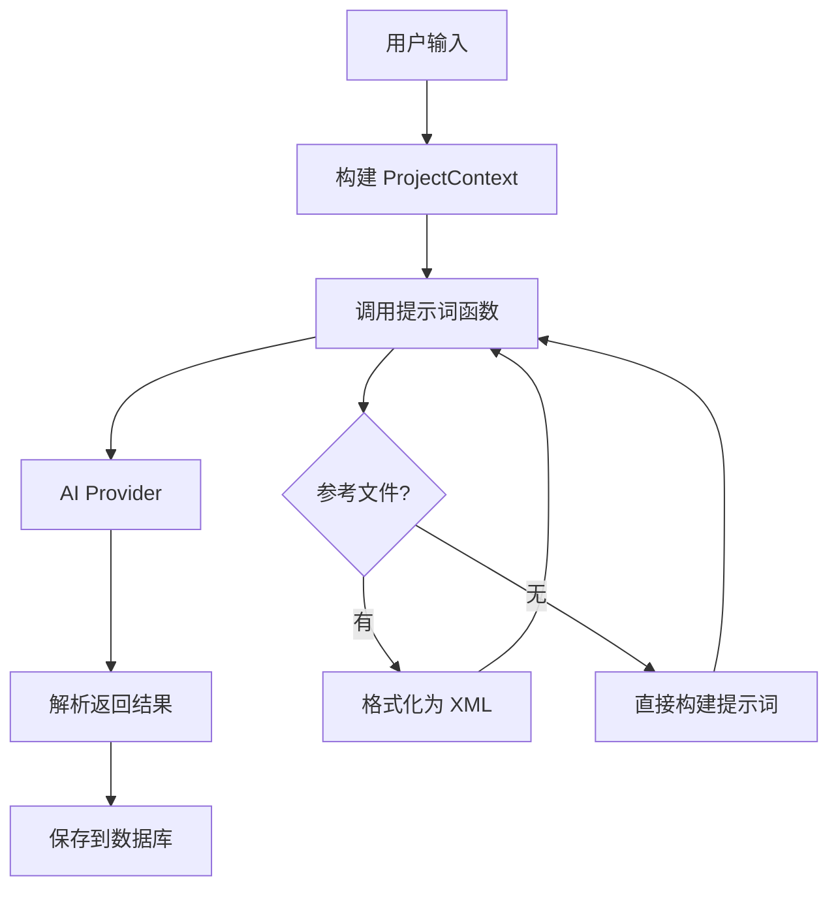
```mermaid
flowchart TD
    A[用户输入] --> B[构建 ProjectContext]
    B --> C[调用提示词函数]
    C --> D[AI Provider]
    D --> E[解析返回结果]
    E --> F[保存到数据库]
    
    C --> G{参考文件?}
    G -->|有| H[格式化为 XML]
    G -->|无| I[直接构建提示词]
    H --> C
    I --> C
```

---

## 2. 核心功能流程

### 2.1 项目创建流程

项目创建是 Banana Slides 的入口功能，用户通过选择创作方式并输入相应内容来创建新项目。

#### 用户操作

1. 用户在首页选择创作方式
   - **想法模式（idea）**：输入一句话描述
   - **大纲模式（outline）**：输入结构化大纲文本
   - **描述模式（descriptions）**：输入逐页描述文本
2. 选择模板风格（可选）
3. 选择图片比例（16:9 / 4:3）
4. 点击"创建项目"按钮

#### 系统处理

**前端流程：**

1. 用户在 [首页创建表单](../../vendors/banana-slides/frontend/src/pages/Home.tsx) 中输入内容
2. 前端根据输入类型确定 `creation_type`
3. 调用 [createProject API](../../vendors/banana-slides/frontend/src/api/endpoints.ts#L24-L42)

**后端流程：**

1. [ProjectController.create_project()](../../vendors/banana-slides/backend/controllers/project_controller.py#L208-L275) 接收请求
2. 验证输入参数（creation_type、内容非空等）
3. 创建 [Project](../../vendors/banana-slides/backend/models/project.py) 记录
4. 创建项目文件夹：`uploads/{project_id}/`
5. 返回项目信息给前端

#### 数据流图

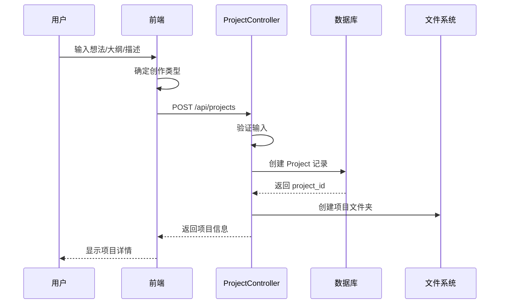
```mermaid
sequenceDiagram
    participant U as 用户
    participant F as 前端
    participant C as ProjectController
    participant DB as 数据库
    participant FS as 文件系统
    
    U->>F: 输入想法/大纲/描述
    F->>F: 确定创作类型
    F->>C: POST /api/projects
    C->>C: 验证输入
    C->>DB: 创建 Project 记录
    DB-->>C: 返回 project_id
    C->>FS: 创建项目文件夹
    C-->>F: 返回项目信息
    F-->>U: 显示项目详情
```

#### 代码位置

**前端：**
- API 定义：[frontend/src/api/endpoints.ts:24-42](../../vendors/banana-slides/frontend/src/api/endpoints.ts#L24-L42)
- 创建表单：[frontend/src/pages/Home.tsx](../../vendors/banana-slides/frontend/src/pages/Home.tsx)

**后端：**
- 控制器：[backend/controllers/project_controller.py:208-275](../../vendors/banana-slides/backend/controllers/project_controller.py#L208-L275)
- 模型：[backend/models/project.py](../../vendors/banana-slides/backend/models/project.py)
- 路由注册：[backend/app.py:118-130](../../vendors/banana-slides/backend/app.py#L118-L130)

#### 提示词引用

项目创建本身不涉及 AI 调用，后续的**大纲生成**会使用提示词：
→ 参见 [提示词章节 2.1 大纲生成提示词](02-prompts-reference.md#21-大纲生成提示词)

#### 输入输出

**请求参数：**
```typescript
{
  creation_type: 'idea' | 'outline' | 'descriptions',
  idea_prompt?: string,           // 想法模式
  outline_text?: string,          // 大纲模式
  description_text?: string,      // 描述模式
  template_style?: string,        // 模板风格（可选）
  image_aspect_ratio?: string     // 图片比例（可选）
}
```

**响应数据：**
```typescript
{
  success: true,
  data: {
    project: {
      id: string,
      creation_type: string,
      pages: [],
      created_at: string
    }
  }
}
```

**副作用：**
- 数据库插入新项目记录
- 创建项目文件夹：`uploads/{project_id}/`

#### 异常处理

| 错误场景 | HTTP 状态码 | 错误信息 | 处理方式 |
|---------|------------|---------|---------|
| 内容为空 | 400 | "Content cannot be empty" | 前端表单验证 |
| creation_type 无效 | 400 | "Invalid creation type" | 前端下拉选择限制 |
| 数据库错误 | 500 | "Failed to create project" | 记录日志，返回通用错误 |

---

### 2.2 大纲生成流程

大纲生成是想法模式（idea）的核心功能，AI 根据用户的一句话想法生成结构化的 PPT 大纲。

#### 用户操作

1. 用户在项目详情页点击"生成大纲"按钮
2. 可选择启用流式生成（实时显示进度）
3. 等待 AI 生成完成

#### 系统处理

**前端流程：**

1. 用户点击"生成大纲"
2. 根据设置选择普通模式或流式模式
3. 调用 [generateOutline()](../../vendors/banana-slides/frontend/src/api/endpoints.ts#L123-L130) 或 [generateOutlineStream()](../../vendors/banana-slides/frontend/src/api/endpoints.ts#L151-L212)
4. 流式模式使用 EventSource 接收 SSE 事件

**后端流程（普通模式）：**

1. [ProjectController.generate_outline()](../../vendors/banana-slides/backend/controllers/project_controller.py#L426-L516) 接收请求
2. 构建 ProjectContext
3. 调用 AIService.generate_outline()
4. 解析返回的大纲 JSON
5. 更新 Project.pages
6. 返回大纲给前端

**后端流程（流式模式）：**

1. [ProjectController.generate_outline_stream()](../../vendors/banana-slides/backend/controllers/project_controller.py#L518-L637) 接收请求
2. 构建 ProjectContext
3. 调用 AIService.generate_outline_stream()
4. 使用生成器模式逐页返回
5. 通过 SSE 发送 `page` 事件
6. 发送 `done` 事件表示完成

#### 数据流图

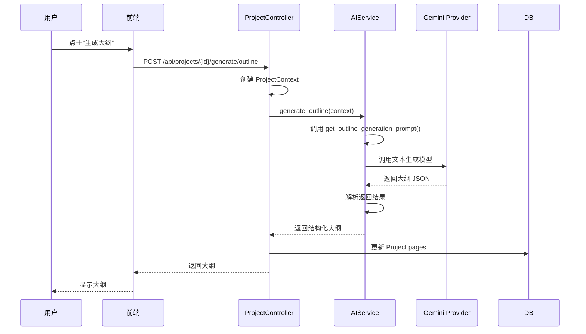
```mermaid
sequenceDiagram
    participant U as 用户
    participant F as 前端
    participant C as ProjectController
    participant AI as AIService
    participant GP as Gemini Provider
    
    U->>F: 点击"生成大纲"
    F->>C: POST /api/projects/{id}/generate/outline
    C->>C: 创建 ProjectContext
    C->>AI: generate_outline(context)
    AI->>AI: 调用 get_outline_generation_prompt()
    AI->>GP: 调用文本生成模型
    GP-->>AI: 返回大纲 JSON
    AI->>AI: 解析返回结果
    AI-->>C: 返回结构化大纲
    C->>DB: 更新 Project.pages
    C-->>F: 返回大纲
    F-->>U: 显示大纲
```

#### 流式生成数据流

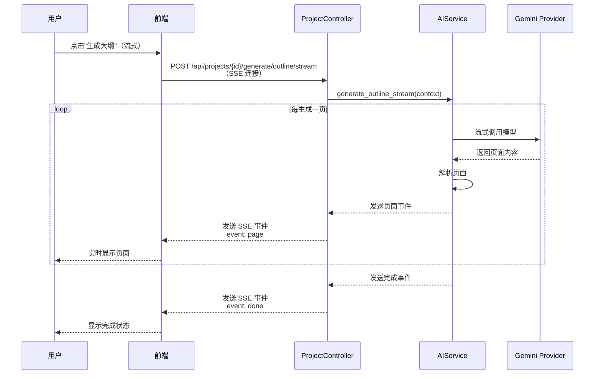
```mermaid
sequenceDiagram
    participant U as 用户
    participant F as 前端
    participant C as ProjectController
    participant AI as AIService
    participant GP as Gemini Provider
    
    U->>F: 点击"生成大纲"（流式）
    F->>C: POST /api/projects/{id}/generate/outline/stream<br>（SSE 连接）
    C->>AI: generate_outline_stream(context)
    
    loop 每生成一页
        AI->>GP: 流式调用模型
        GP-->>AI: 返回页面内容
        AI->>AI: 解析页面
        AI-->>C: 发送页面事件
        C-->>F: 发送 SSE 事件<br>event: page
        F-->>U: 实时显示页面
    end
    
    AI-->>C: 发送完成事件
    C-->>F: 发送 SSE 事件<br>event: done
    F-->>U: 显示完成状态
```

#### 代码位置

**前端：**
- 普通模式：[frontend/src/api/endpoints.ts:123-130](../../vendors/banana-slides/frontend/src/api/endpoints.ts#L123-L130)
- 流式模式：[frontend/src/api/endpoints.ts:151-212](../../vendors/banana-slides/frontend/src/api/endpoints.ts#L151-L212)

**后端：**
- 普通模式：[backend/controllers/project_controller.py:426-516](../../vendors/banana-slides/backend/controllers/project_controller.py#L426-L516)
- 流式模式：[backend/controllers/project_controller.py:518-637](../../vendors/banana-slides/backend/controllers/project_controller.py#L518-L637)
- AI 服务：[backend/services/ai_service.py:328-342](../../vendors/banana-slides/backend/services/ai_service.py#L328-L342)
- 流式 AI 服务：[backend/services/ai_service.py:391-553](../../vendors/banana-slides/backend/services/ai_service.py#L391-L553)

#### 提示词引用

**提示词：** `get_outline_generation_prompt()`

**关键参数：**
- `project_context.creation_type`：创作类型（idea/outline/descriptions）
- `project_context.idea_prompt`：用户输入的想法
- `language`：输出语言（zh/ja/en/auto）

**提示词内容：** → 参见 [提示词章节 2.1 大纲生成提示词](02-prompts-reference.md#21-大纲生成提示词)

#### 输入输出

**请求参数（普通模式）：**
```typescript
{
  language?: string  // 输出语言（zh/ja/en/auto）
}
```

**响应数据（普通模式）：**
```typescript
{
  success: true,
  data: {
    outline: {
      title: string,
      parts: Array<{
        name: string,
        pages: Array<{
          title: string,
          points: string[]
        }>
      }>
    }
  }
}
```

**SSE 事件（流式模式）：**
- `event: page` - 每生成一页发送
- `event: done` - 完成时发送

**副作用：**
- 更新 Project.pages

#### 异常处理

| 错误场景 | HTTP 状态码 | 错误信息 | 处理方式 |
|---------|------------|---------|---------|
| 项目不存在 | 404 | "Project not found" | 返回错误，前端提示 |
| API Key 未配置 | 500 | "AI service not properly configured" | 前端提示用户检查设置 |
| AI 超时 | 504 | "AI request timeout" | 自动重试 3 次 |
| JSON 解析失败 | 500 | "Failed to parse outline" | 记录错误日志，返回友好提示 |

---

### 2.3 页面描述生成流程

页面描述生成基于大纲，为每一页生成详细的内容描述，包括文字内容、所需素材等。

#### 用户操作

1. 用户在大纲确认后点击"生成描述"
2. 可选择启用流式生成
3. 等待 AI 生成完成

#### 系统处理

**前端流程：**

1. 用户点击"生成描述"
2. 调用 [generateDescriptions()](../../vendors/banana-slides/frontend/src/api/endpoints.ts#L239-L246) 或流式版本
3. 流式模式使用 EventSource 接收

**后端流程（普通模式）：**

1. [ProjectController.generate_descriptions()](../../vendors/banana-slides/backend/controllers/project_controller.py#L756-L847) 接收请求
2. 构建 ProjectContext
3. 创建 Task（异步任务）
4. 提交到 TaskManager
5. 返回 task_id 给前端
6. TaskManager 并发生成所有页面描述
7. 前端轮询任务状态

**后端流程（流式模式）：**

1. [ProjectController.generate_descriptions_stream()](../../vendors/banana-slides/backend/controllers/project_controller.py#L849-L989) 接收请求
2. 构建 ProjectContext
3. 调用 AIService.generate_descriptions_stream()
4. 使用生成器模式逐页返回
5. 通过 SSE 发送事件

#### 数据流图

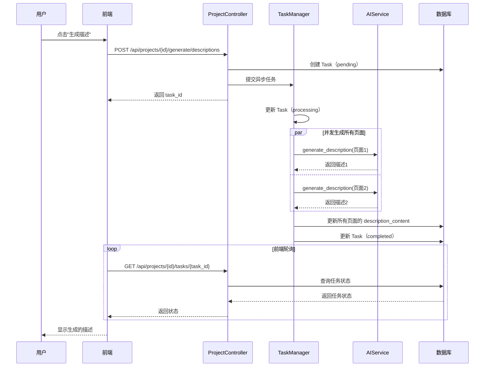
```mermaid
sequenceDiagram
    participant U as 用户
    participant F as 前端
    participant C as ProjectController
    participant TM as TaskManager
    participant AI as AIService
    participant DB as 数据库
    
    U->>F: 点击"生成描述"
    F->>C: POST /api/projects/{id}/generate/descriptions
    C->>DB: 创建 Task（pending）
    C->>TM: 提交异步任务
    C-->>F: 返回 task_id
    
    TM->>TM: 更新 Task（processing）
    
    par 并发生成所有页面
        TM->>AI: generate_description(页面1)
        AI-->>TM: 返回描述1
    and
        TM->>AI: generate_description(页面2)
        AI-->>TM: 返回描述2
    end
    
    TM->>DB: 更新所有页面的 description_content
    TM->>DB: 更新 Task（completed）
    
    loop 前端轮询
        F->>C: GET /api/projects/{id}/tasks/{task_id}
        C->>DB: 查询任务状态
        DB-->>C: 返回任务状态
        C-->>F: 返回状态
    end
    
    F-->>U: 显示生成的描述
```

#### 流式生成描述

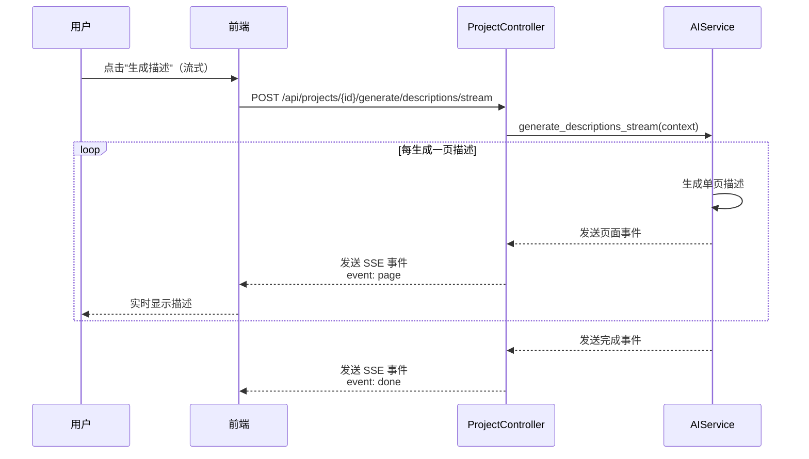
```mermaid
sequenceDiagram
    participant U as 用户
    participant F as 前端
    participant C as ProjectController
    participant AI as AIService
    
    U->>F: 点击"生成描述"（流式）
    F->>C: POST /api/projects/{id}/generate/descriptions/stream
    C->>AI: generate_descriptions_stream(context)
    
    loop 每生成一页描述
        AI->>AI: 生成单页描述
        AI-->>C: 发送页面事件
        C-->>F: 发送 SSE 事件<br>event: page
        F-->>U: 实时显示描述
    end
    
    AI-->>C: 发送完成事件
    C-->>F: 发送 SSE 事件<br>event: done
```

#### 代码位置

**前端：**
- 普通模式：[frontend/src/api/endpoints.ts:239-246](../../vendors/banana-slides/frontend/src/api/endpoints.ts#L239-L246)
- 流式模式：[frontend/src/api/endpoints.ts:264-324](../../vendors/banana-slides/frontend/src/api/endpoints.ts#L264-L324)

**后端：**
- 普通模式：[backend/controllers/project_controller.py:333-L372](../../vendors/banana-slides/backend/controllers/project_controller.py#L756-L847)
- 流式模式：[backend/controllers/project_controller.py:849-989](../../vendors/banana-slides/backend/controllers/project_controller.py#L849-L989)
- AI 服务：[backend/services/ai_service.py:683-804](../../vendors/banana-slides/backend/services/ai_service.py#L683-L804)
- 任务管理：[backend/services/task_manager.py:362-519](../../vendors/banana-slides/backend/services/task_manager.py#L362-L519)

#### 提示词引用

**提示词：** `get_page_description_prompt()`（单页）或 `get_all_descriptions_stream_prompt()`（批量流式）

**关键参数：**
- `project_context.outline_text`：大纲文本
- `detail_level`：细致程度（concise/default/detailed）
- `language`：输出语言

**提示词内容：** → 参见 [提示词章节 3.1 单页描述生成提示词](02-prompts-reference.md#31-单页描述生成提示词)

#### 输入输出

**请求参数：**
```typescript
{
  detail_level?: 'concise' | 'default' | 'detailed',
  language?: string
}
```

**响应数据（异步模式）：**
```typescript
{
  success: true,
  data: {
    task_id: string
  }
}
```

**任务状态：**
```typescript
{
  status: 'pending' | 'processing' | 'completed' | 'failed',
  result: any,
  error: string
}
```

**副作用：**
- 更新所有页面的 description_content
- 创建 Task 记录

#### 异常处理

| 错误场景 | HTTP 状态码 | 错误信息 | 处理方式 |
|---------|------------|---------|---------|
| 大纲为空 | 400 | "Outline is empty" | 前端提示先生成大纲 |
| AI 调用失败 | 500 | "Failed to generate descriptions" | 任务标记为 failed，显示错误 |
| 部分页面失败 | 200 | 部分成功，部分失败 | 标记失败页面，继续执行 |

---

### 2.4 图片生成流程

图片生成是 Banana Slides 的核心功能，基于页面描述生成 PPT 页面的视觉图片。

#### 用户操作

1. 用户在描述生成后点击"生成图片"
2. 等待异步任务完成（可查看进度）
3. 查看生成的图片

#### 系统处理

**前端流程：**

1. 用户点击"生成图片"
2. 调用 [generateImages()](../../vendors/banana-slides/frontend/src/api/endpoints.ts#L419-L426)
3. 获取 task_id
4. 轮询任务状态

**后端流程：**

1. [ProjectController.generate_images()](../../vendors/banana-slides/backend/controllers/project_controller.py#L991-L1109) 接收请求
2. 创建 Task（pending）
3. 提交到 TaskManager
4. 返回 task_id
5. TaskManager.generate_images_task() 并发生成所有页面图片
6. 每生成一张图片：
   - 调用 AIService.generate_image()
   - 保存图片到文件系统
   - 保存图片版本记录
   - 更新 Page.image_url
7. 更新 Task 状态

#### 数据流图

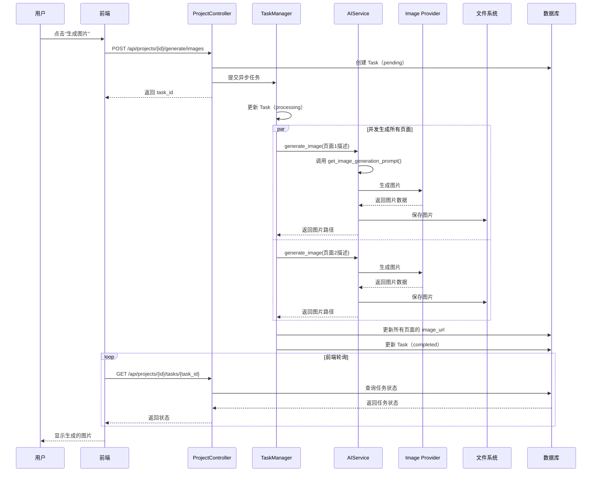
```mermaid
sequenceDiagram
    participant U as 用户
    participant F as 前端
    participant C as ProjectController
    participant TM as TaskManager
    participant AI as AIService
    participant IP as Image Provider
    participant FS as 文件系统
    participant DB as 数据库
    
    U->>F: 点击"生成图片"
    F->>C: POST /api/projects/{id}/generate/images
    C->>DB: 创建 Task（pending）
    C->>TM: 提交异步任务
    C-->>F: 返回 task_id
    
    TM->>TM: 更新 Task（processing）
    
    par 并发生成所有页面
        TM->>AI: generate_image(页面1描述)
        AI->>AI: 调用 get_image_generation_prompt()
        AI->>IP: 生成图片
        IP-->>AI: 返回图片数据
        AI->>FS: 保存图片
        AI-->>TM: 返回图片路径
    and
        TM->>AI: generate_image(页面2描述)
        AI->>IP: 生成图片
        IP-->>AI: 返回图片数据
        AI->>FS: 保存图片
        AI-->>TM: 返回图片路径
    end
    
    TM->>DB: 更新所有页面的 image_url
    TM->>DB: 更新 Task（completed）
    
    loop 前端轮询
        F->>C: GET /api/projects/{id}/tasks/{task_id}
        C->>DB: 查询任务状态
        DB-->>C: 返回任务状态
        C-->>F: 返回状态
    end
    
    F-->>U: 显示生成的图片
```

#### 代码位置

**前端：**
- API 调用：[frontend/src/api/endpoints.ts:419-426](../../vendors/banana-slides/frontend/src/api/endpoints.ts#L419-L426)

**后端：**
- 控制器：[backend/controllers/project_controller.py:991-1109](../../vendors/banana-slides/backend/controllers/project_controller.py#L991-L1109)
- AI 服务：[backend/services/ai_service.py:877-995](../../vendors/banana-slides/backend/services/ai_service.py#L877-L995)
- 任务管理：[backend/services/task_manager.py:521-752](../../vendors/banana-slides/backend/services/task_manager.py#L521-L752)

#### 提示词引用

**提示词：** `get_image_generation_prompt()`

**关键参数：**
- `page.description_content`：页面描述内容
- `page.title`：页面标题
- `template_image_url`：模板图片（可选）
- `materials`：素材图片列表（可选）

**提示词内容：** → 参见 [提示词章节 4.1 文生图提示词](02-prompts-reference.md#41-文生图提示词)

#### 输入输出

**请求参数：**
```typescript
{
  // 无需额外参数，使用项目的现有数据
}
```

**响应数据：**
```typescript
{
  success: true,
  data: {
    task_id: string
  }
}
```

**副作用：**
- 生成图片文件到 `uploads/{project_id}/pages/{page_id}/`
- 更新所有页面的 image_url
- 保存图片版本记录

#### 异常处理

| 错误场景 | HTTP 状态码 | 错误信息 | 处理方式 |
|---------|------------|---------|---------|
| 描述为空 | 400 | "Descriptions are empty" | 前端提示先生成描述 |
| AI 超时 | 504 | "Image generation timeout" | 重试 3 次 |
| 部分图片失败 | 200 | 部分成功 | 记录失败页面，继续执行 |
| 图片保存失败 | 500 | "Failed to save image" | 标记任务失败 |

---

### 2.5 图片编辑流程（Vibe 式修改）

Vibe 式图片编辑是 Banana Slides 的特色功能，用户可以用自然语言描述想要的修改，AI 自动编辑图片。

#### 用户操作

1. 用户在图片编辑器中框选区域（可选）
2. 输入自然语言修改指令（如"把这个区域换成饼图"）
3. 点击"编辑"按钮
4. 查看编辑结果

#### 系统处理

**前端流程：**

1. 用户可选择框选区域
2. 输入修改指令
3. 调用 [editPageImage()](../../vendors/banana-slides/frontend/src/api/endpoints.ts#L448-L490)
4. 轮询任务状态

**后端流程：**

1. [PageController.edit_page_image()](../../vendors/banana-slides/backend/controllers/page_controller.py#L501-L674) 接收请求
2. 解析用户指令和框选坐标
3. 创建 Task
4. 提交到 TaskManager
5. TaskManager.edit_page_image_task() 执行：
   - 获取当前图片
   - 处理框选区域
   - 构建编辑提示词
   - 调用 AI 图片编辑
   - 保存新图片版本
   - 更新 Page.image_url

#### 数据流图

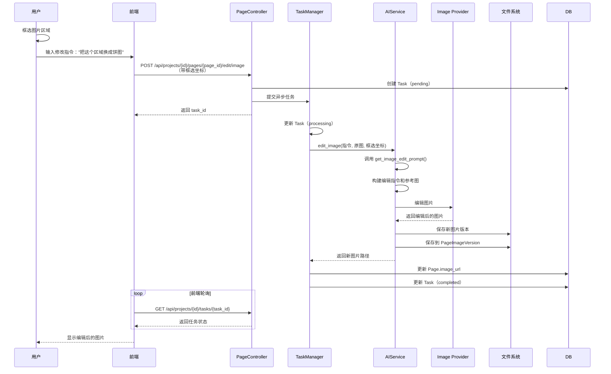
```mermaid
sequenceDiagram
    participant U as 用户
    participant F as 前端
    participant C as PageController
    participant TM as TaskManager
    participant AI as AIService
    participant IP as Image Provider
    participant FS as 文件系统
    
    U->>U: 框选图片区域
    U->>F: 输入修改指令："把这个区域换成饼图"
    F->>C: POST /api/projects/{id}/pages/{page_id}/edit/image<br>（带框选坐标）
    C->>DB: 创建 Task（pending）
    C->>TM: 提交异步任务
    C-->>F: 返回 task_id
    
    TM->>TM: 更新 Task（processing）
    TM->>AI: edit_image(指令, 原图, 框选坐标)
    AI->>AI: 调用 get_image_edit_prompt()
    AI->>AI: 构建编辑指令和参考图
    AI->>IP: 编辑图片
    IP-->>AI: 返回编辑后的图片
    AI->>FS: 保存新图片版本
    AI->>FS: 保存到 PageImageVersion
    AI-->>TM: 返回新图片路径
    
    TM->>DB: 更新 Page.image_url
    TM->>DB: 更新 Task（completed）
    
    loop 前端轮询
        F->>C: GET /api/projects/{id}/tasks/{task_id}
        C-->>F: 返回任务状态
    end
    
    F-->>U: 显示编辑后的图片
```

#### 代码位置

**前端：**
- API 调用：[frontend/src/api/endpoints.ts:448-490](../../vendors/banana-slides/frontend/src/api/endpoints.ts#L448-L490)

**后端：**
- 控制器：[backend/controllers/page_controller.py:501-674](../../vendors/banana-slides/backend/controllers/page_controller.py#L501-L674)
- AI 服务：[backend/services/ai_service.py:997-1021](../../vendors/banana-slides/backend/services/ai_service.py#L997-L1021)
- 任务管理：[backend/services/task_manager.py:898-1010](../../vendors/banana-slides/backend/services/task_manager.py#L898-L1010)

#### 提示词引用

**提示词：** `get_image_edit_prompt()`

**关键参数：**
- `instruction`：用户修改指令
- `original_image_url`：原图 URL
- `bbox`：框选区域坐标（可选）
- `mask_url`：区域遮罩（可选）

**提示词内容：** → 参见 [提示词章节 4.2 图片编辑提示词](02-prompts-reference.md#42-图片编辑提示词)

#### 输入输出

**请求参数：**
```typescript
{
  instruction: string,           // 修改指令
  bbox?: {                       // 框选区域（可选）
    x: number,
    y: number,
    width: number,
    height: number
  }
}
```

**响应数据：**
```typescript
{
  success: true,
  data: {
    task_id: string
  }
}
```

**副作用：**
- 保存新图片版本
- 更新 Page.image_url
- 插入 PageImageVersion 记录

#### 异常处理

| 错误场景 | HTTP 状态码 | 错误信息 | 处理方式 |
|---------|------------|---------|---------|
| 指令为空 | 400 | "Instruction cannot be empty" | 前端验证 |
| 原图不存在 | 404 | "Original image not found" | 提示用户先生成图片 |
| AI 编辑失败 | 500 | "Failed to edit image" | 任务标记为 failed |

---

### 2.6 文件解析流程（PDF/Docx 等）

文件解析功能允许用户上传参考文件，系统提取内容供 AI 参考。

#### 用户操作

1. 用户点击"上传参考文件"
2. 选择 PDF/Docx/MD/Txt 文件
3. 系统自动解析文件内容
4. 关联到项目

#### 系统处理

**前端流程：**

1. 用户选择文件
2. 调用 [uploadReferenceFile()](../../vendors/banana-slides/frontend/src/api/endpoints.ts#L1137-L1152)
3. 调用 [triggerFileParse()](../../vendors/banana-slides/frontend/src/api/endpoints.ts#L1193-L1198) 触发解析
4. 调用 [associateFileToProject()](../../vendors/banana-slides/frontend/src/api/endpoints.ts#L1205-L1214) 关联到项目

**后端流程：**

1. [ReferenceFileController.upload()](../../vendors/banana-slides/backend/controllers/reference_file_controller.py#L134-L241) 接收文件
2. 保存文件到 `uploads/reference_files/`
3. 创建 ReferenceFile 记录
4. [ReferenceFileController.parse()](../../vendors/banana-slides/backend/controllers/reference_file_controller.py#L337-L392) 解析文件：
   - PDF：使用 MinerU 或 PyPDF2
   - Docx：使用 python-docx
   - Markdown/Txt：直接读取
5. 提取文本和图片
6. 更新 markdown_content
7. 关联到项目

#### 数据流图

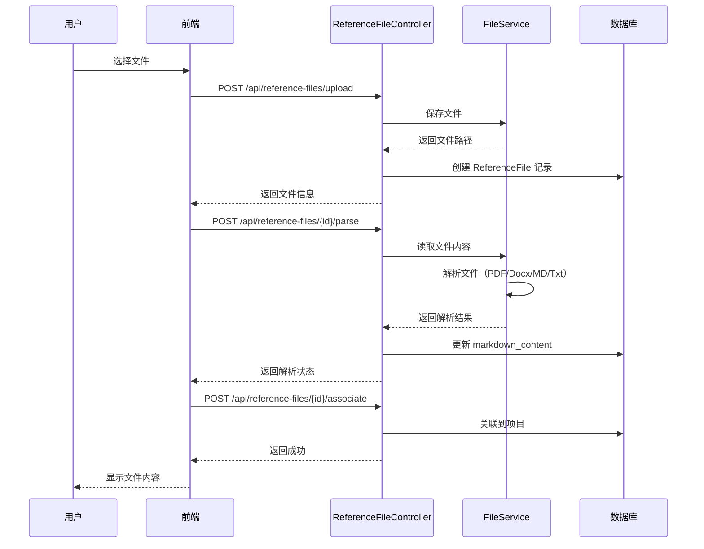
```mermaid
sequenceDiagram
    participant U as 用户
    participant F as 前端
    participant RFC as ReferenceFileController
    participant FS as FileService
    participant DB as 数据库
    
    U->>F: 选择文件
    F->>RFC: POST /api/reference-files/upload
    RFC->>FS: 保存文件
    FS-->>RFC: 返回文件路径
    RFC->>DB: 创建 ReferenceFile 记录
    RFC-->>F: 返回文件信息
    
    F->>RFC: POST /api/reference-files/{id}/parse
    RFC->>FS: 读取文件内容
    FS->>FS: 解析文件（PDF/Docx/MD/Txt）
    FS-->>RFC: 返回解析结果
    RFC->>DB: 更新 markdown_content
    RFC-->>F: 返回解析状态
    
    F->>RFC: POST /api/reference-files/{id}/associate
    RFC->>DB: 关联到项目
    RFC-->>F: 返回成功
    F-->>U: 显示文件内容
```

#### 代码位置

**前端：**
- 上传文件：[frontend/src/api/endpoints.ts:1137-1152](../../vendors/banana-slides/frontend/src/api/endpoints.ts#L1137-L1152)
- 触发解析：[frontend/src/api/endpoints.ts:1193-1198](../../vendors/banana-slides/frontend/src/api/endpoints.ts#L1193-L1198)
- 关联文件：[frontend/src/api/endpoints.ts:1205-L1214](../../vendors/banana-slides/frontend/src/api/endpoints.ts#L1205-L1214)

**后端：**
- 文件上传：[backend/controllers/reference_file_controller.py:134-241](../../vendors/banana-slides/backend/controllers/reference_file_controller.py#L134-L241)
- 文件解析：[backend/controllers/reference_file_controller.py:337-392](../../vendors/banana-slides/backend/controllers/reference_file_controller.py#L337-L392)
- 文件关联：[backend/controllers/reference_file_controller.py:393-457](../../vendors/banana-slides/backend/controllers/reference_file_controller.py#L393-L457)

#### 提示词引用

文件解析本身不使用 AI 提示词，但解析后的内容会作为参考文件影响提示词构建。

**参考文件处理：**
- 使用 `_format_reference_files_xml()` 将文件内容格式化为 XML
- 添加到提示词的参考文件部分

**提示词构建：** → 参见 [提示词章节 1.2 共享组件与常量](02-prompts-reference.md#12-共享组件与常量)

#### 输入输出

**上传文件请求：**
```typescript
{
  file: File,
  project_id?: string  // 可选，直接关联到项目
}
```

**上传文件响应：**
```typescript
{
  success: true,
  data: {
    reference_file: {
      id: string,
      filename: string,
      file_size: number,
      file_type: string,
      parse_status: 'pending' | 'parsing' | 'completed' | 'failed'
    }
  }
}
```

**触发解析响应：**
```typescript
{
  success: true,
  data: {
    parse_status: 'parsing'
  }
}
```

**副作用：**
- 保存文件到 `uploads/reference_files/{file_id}/`
- 创建 ReferenceFile 记录
- 更新 markdown_content

#### 异常处理

| 错误场景 | HTTP 状态码 | 错误信息 | 处理方式 |
|---------|------------|---------|---------|
| 文件类型不支持 | 400 | "Unsupported file type" | 前端限制文件选择 |
| 文件过大 | 400 | "File size exceeds limit" | 前端验证文件大小 |
| 解析失败 | 500 | "Failed to parse file" | 记录错误，标记状态为 failed |

---

### 2.7 导出流程（PPTX/PDF/视频）

导出功能将项目导出为 PPTX、PDF 或视频格式。

#### 用户操作

1. 用户点击"导出"按钮
2. 选择导出格式（PPTX/PDF/视频）
3. 等待导出完成
4. 下载文件

#### 系统处理

**前端流程：**

1. 用户选择导出格式
2. PPTX/PDF：调用 [exportPPTX()](../../vendors/banana-slides/frontend/src/api/endpoints.ts#L681-L698) 或 [exportPDF()](../../vendors/banana-slides/frontend/src/api/endpoints.ts#L705-L714)
3. 视频：调用 [exportVideo()](../../vendors/banana-slides/frontend/src/api/endpoints.ts#L771-L810)
4. 下载返回的文件

**后端流程（PPTX）：**

1. [ExportController.export_pptx()](../../vendors/banana-slides/backend/controllers/export_controller.py#L94-L180) 接收请求
2. 查询项目所有页面
3. 调用 ExportService.build_pptx()
4. 读取所有页面图片
5. 创建 PPTX 文件
6. 添加每页图片和文字
7. 应用页面切换动画（可选）
8. 保存 PPTX 文件
9. 返回下载 URL

**后端流程（视频 - 异步）：**

1. [ExportController.export_video()](../../vendors/banana-slides/backend/controllers/export_controller.py#L465-L585) 接收请求
2. 创建 Task
3. 提交到 TaskManager
4. TaskManager.export_video_task() 执行：
   - 生成旁白（如需要）
   - 渲染每页为图片
   - 使用 FFmpeg 合成视频
   - 添加字幕和旁白
5. 返回下载 URL

#### 数据流图（PPTX 导出）

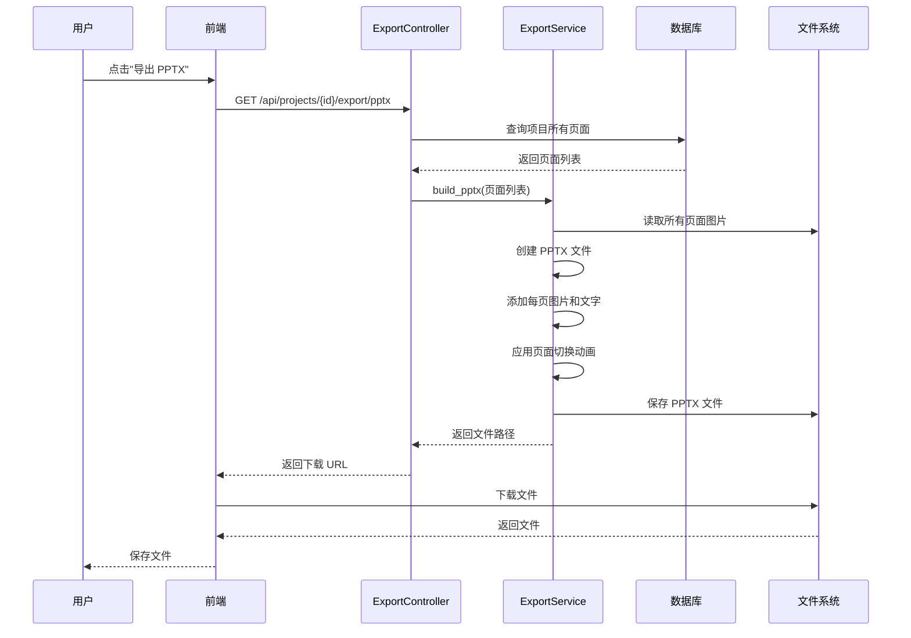
```mermaid
sequenceDiagram
    participant U as 用户
    participant F as 前端
    participant C as ExportController
    participant ES as ExportService
    participant DB as 数据库
    participant FS as 文件系统
    
    U->>F: 点击"导出 PPTX"
    F->>C: GET /api/projects/{id}/export/pptx
    C->>DB: 查询项目所有页面
    DB-->>C: 返回页面列表
    C->>ES: build_pptx(页面列表)
    ES->>FS: 读取所有页面图片
    ES->>ES: 创建 PPTX 文件
    ES->>ES: 添加每页图片和文字
    ES->>ES: 应用页面切换动画
    ES->>FS: 保存 PPTX 文件
    ES-->>C: 返回文件路径
    C-->>F: 返回下载 URL
    F->>FS: 下载文件
    FS-->>F: 返回文件
    F-->>U: 保存文件
```

#### 数据流图（视频导出）

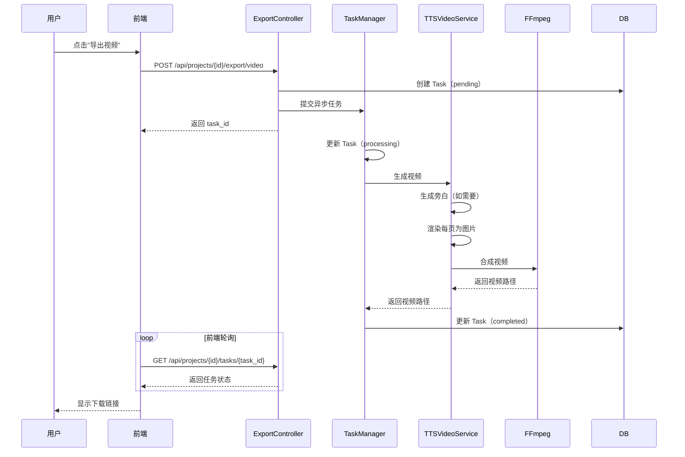
```mermaid
sequenceDiagram
    participant U as 用户
    participant F as 前端
    participant C as ExportController
    participant TM as TaskManager
    participant TTS as TTSVideoService
    participant FFmpeg as FFmpeg
    
    U->>F: 点击"导出视频"
    F->>C: POST /api/projects/{id}/export/video
    C->>DB: 创建 Task（pending）
    C->>TM: 提交异步任务
    C-->>F: 返回 task_id
    
    TM->>TM: 更新 Task（processing）
    TM->>TTS: 生成视频
    TTS->>TTS: 生成旁白（如需要）
    TTS->>TTS: 渲染每页为图片
    TTS->>FFmpeg: 合成视频
    FFmpeg-->>TTS: 返回视频路径
    TTS-->>TM: 返回视频路径
    TM->>DB: 更新 Task（completed）
    
    loop 前端轮询
        F->>C: GET /api/projects/{id}/tasks/{task_id}
        C-->>F: 返回任务状态
    end
    
    F-->>U: 显示下载链接
```

#### 代码位置

**前端：**
- PPTX 导出：[frontend/src/api/endpoints.ts:681-698](../../vendors/banana-slides/frontend/src/api/endpoints.ts#L681-L698)
- PDF 导出：[frontend/src/api/endpoints.ts:705-714](../../vendors/banana-slides/frontend/src/api/endpoints.ts#L705-L714)
- 视频导出：[frontend/src/api/endpoints.ts:771-810](../../vendors/banana-slides/frontend/src/api/endpoints.ts#L771-L810)

**后端：**
- PPTX 导出：[backend/controllers/export_controller.py:94-180](../../vendors/banana-slides/backend/controllers/export_controller.py#L94-L180)
- PDF 导出：[backend/controllers/export_controller.py:180-253](../../vendors/banana-slides/backend/controllers/export_controller.py#L180-L253)
- 视频导出：[backend/controllers/export_controller.py:465-585](../../vendors/banana-slides/backend/controllers/export_controller.py#L465-L585)
- 导出服务：[backend/services/export_service.py](../../vendors/banana-slides/backend/services/export_service.py)

#### 提示词引用

**PPTX/PDF 导出：** 不使用 AI 提示词

**视频导出旁白生成：**
- **提示词：** `get_narration_generation_prompt()`
- **关键参数：** 页面内容、演讲者人设、听众、语调、主题
- **提示词内容：** → 参见 [提示词章节 6.1 旁白生成提示词](02-prompts-reference.md#61-旁白生成提示词)

#### 输入输出

**PPTX 导出请求：**
```typescript
{
  animation_type?: string  // 页面切换动画（可选）
}
```

**视频导出请求：**
```typescript
{
  narration_config?: {
    speaker_persona: string,
    target_audience: string,
    tone_style: string,
    topic: string,
    word_count_range: [number, number]
  },
  language?: string
}
```

**响应数据（异步）：**
```typescript
{
  success: true,
  data: {
    task_id: string
  }
}
```

**副作用：**
- 生成导出文件到 `uploads/exports/`
- 创建 Task 记录（视频导出）

#### 异常处理

| 错误场景 | HTTP 状态码 | 错误信息 | 处理方式 |
|---------|------------|---------|---------|
| 项目无页面 | 400 | "Project has no pages" | 提示用户先生成内容 |
| PPTX 生成失败 | 500 | "Failed to generate PPTX" | 记录错误，返回友好提示 |
| FFmpeg 未安装 | 500 | "FFmpeg not found" | 提示管理员安装 FFmpeg |

---

### 2.8 素材管理流程

素材管理功能允许用户上传、生成和管理图片素材。

#### 用户操作

1. 用户点击"素材库"
2. 可以上传素材图片
3. 可以 AI 生成素材
4. 可以编辑或擦除素材
5. 关联素材到项目

#### 系统处理

**前端流程：**

1. 调用 [listMaterials()](../../vendors/banana-slides/frontend/src/api/endpoints.ts#L918-L936) 获取素材列表
2. 上传：调用 [uploadMaterial()](../../vendors/banana-slides/frontend/src/api/endpoints.ts#L945-L968)
3. 生成：调用 [generateMaterialImage()](../../vendors/banana-slides/frontend/src/api/endpoints.ts#L818-L845)
4. 处理：调用 [processMaterialImage()](../../vendors/banana-slides/frontend/src/api/endpoints.ts#L873-L908)
5. 关联：调用 [associateMaterialsToProject()](../../vendors/banana-slides/frontend/src/api/endpoints.ts#L1024-L1033)

**后端流程：**

1. [MaterialController](../../vendors/banana-slides/backend/controllers/material_controller.py) 处理请求
2. 上传素材：保存文件，创建 Material 记录
3. 生成素材：调用 AI 生成图片
4. 处理素材：编辑或擦除素材
5. 关联素材：更新 Material.project_id

#### 数据流图

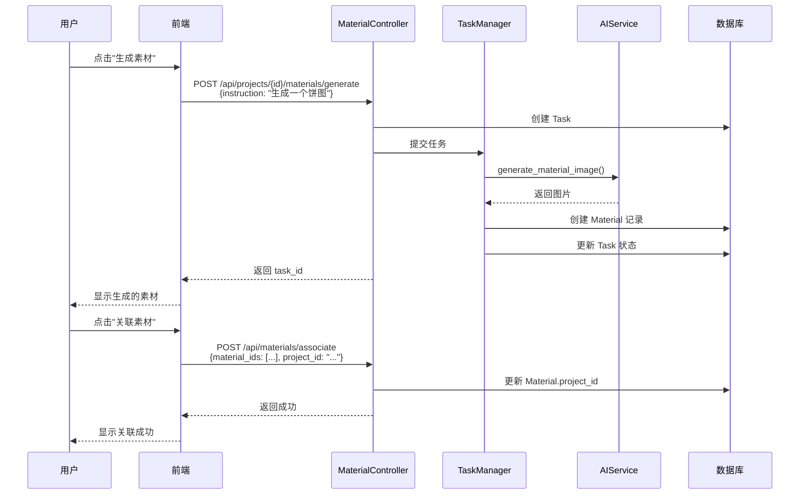
```mermaid
sequenceDiagram
    participant U as 用户
    participant F as 前端
    participant MC as MaterialController
    participant TM as TaskManager
    participant AI as AIService
    participant DB as 数据库
    
    U->>F: 点击"生成素材"
    F->>MC: POST /api/projects/{id}/materials/generate<br>{instruction: "生成一个饼图"}
    MC->>DB: 创建 Task
    MC->>TM: 提交任务
    TM->>AI: generate_material_image()
    AI-->>TM: 返回图片
    TM->>DB: 创建 Material 记录
    TM->>DB: 更新 Task 状态
    MC-->>F: 返回 task_id
    F-->>U: 显示生成的素材
    
    U->>F: 点击"关联素材"
    F->>MC: POST /api/materials/associate<br>{material_ids: [...], project_id: "..."}
    MC->>DB: 更新 Material.project_id
    MC-->>F: 返回成功
    F-->>U: 显示关联成功
```

#### 代码位置

**前端：**
- 素材列表：[frontend/src/api/endpoints.ts:918-936](../../vendors/banana-slides/frontend/src/api/endpoints.ts#L918-L936)
- 上传素材：[frontend/src/api/endpoints.ts:945-968](../../vendors/banana-slides/frontend/src/api/endpoints.ts#L945-L968)
- 生成素材：[frontend/src/api/endpoints.ts:818-845](../../vendors/banana-slides/frontend/src/api/endpoints.ts#L818-L845)
- 处理素材：[frontend/src/api/endpoints.ts:873-L908](../../vendors/banana-slides/frontend/src/api/endpoints.ts#L873-L908)
- 关联素材：[frontend/src/api/endpoints.ts:1024-1033](../../vendors/banana-slides/frontend/src/api/endpoints.ts#L1024-L1033)

**后端：**
- 控制器：[backend/controllers/material_controller.py](../../vendors/banana-slides/backend/controllers/material_controller.py)
- 任务管理：[backend/services/task_manager.py:1012-1284](../../vendors/banana-slides/backend/services/task_manager.py#L1012-L1284)

#### 提示词引用

素材生成和编辑使用与页面图片类似的提示词：
- 生成素材：`get_image_generation_prompt()`
- 编辑素材：`get_image_edit_prompt()`

→ 参见 [提示词章节 4. 图片提示词](02-prompts-reference.md#4-图片提示词image-prompts)

#### 输入输出

**生成素材请求：**
```typescript
{
  instruction: string,
  operation: 'generate' | 'edit_full' | 'region_edit' | 'erase_region',
  bbox?: { x, y, width, height },
  reference_material_id?: string
}
```

**关联素材请求：**
```typescript
{
  material_ids: string[],
  project_id: string
}
```

**响应数据：**
```typescript
{
  success: true,
  data: {
    task_id: string
  }
}
```

**副作用：**
- 创建 Material 记录
- 保存素材图片
- 更新 Material.project_id

#### 异常处理

| 错误场景 | HTTP 状态码 | 错误信息 | 处理方式 |
|---------|------------|---------|---------|
| 指令为空 | 400 | "Instruction cannot be empty" | 前端验证 |
| 素材不存在 | 404 | "Material not found" | 返回错误 |
| AI 生成失败 | 500 | "Failed to generate material" | 任务标记为 failed |

---

### 2.9 PPT 翻新流程

PPT 翻新功能允许用户上传现有 PPT（PDF/PPTX），系统重新生成内容。

#### 用户操作

1. 用户选择"PPT 翻新"
2. 上传 PDF/PPTX 文件
3. 系统解析内容
4. 生成新的大纲、描述和图片
5. 导出新 PPT

#### 系统处理

**前端流程：**

1. 用户选择文件
2. 调用翻新 API（类似创建项目）
3. 等待解析和生成完成

**后端流程：**

1. [ProjectController.renovation()](../../vendors/banana-slides/backend/controllers/project_controller.py#L1350-L1594) 接收文件
2. 使用 MinerU 解析 PDF/PPTX
3. 提取每页内容
4. 生成大纲和描述
5. 生成封面图片
6. 返回项目信息

#### 数据流图

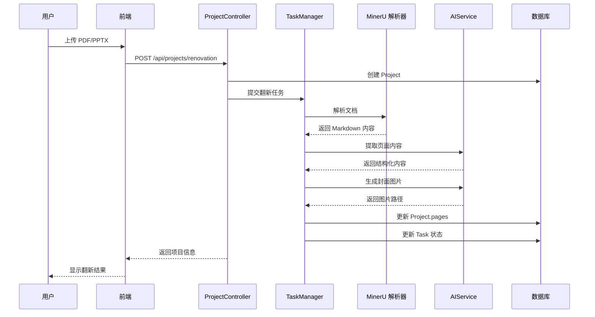
```mermaid
sequenceDiagram
    participant U as 用户
    participant F as 前端
    participant PC as ProjectController
    participant TM as TaskManager
    participant MinerU as MinerU 解析器
    participant AI as AIService
    participant DB as 数据库
    
    U->>F: 上传 PDF/PPTX
    F->>PC: POST /api/projects/renovation
    PC->>DB: 创建 Project
    PC->>TM: 提交翻新任务
    TM->>MinerU: 解析文档
    MinerU-->>TM: 返回 Markdown 内容
    TM->>AI: 提取页面内容
    AI-->>TM: 返回结构化内容
    TM->>AI: 生成封面图片
    AI-->>TM: 返回图片路径
    TM->>DB: 更新 Project.pages
    TM->>DB: 更新 Task 状态
    PC-->>F: 返回项目信息
    F-->>U: 显示翻新结果
```

#### 代码位置

**前端：**
- 翻新 API：[frontend/src/api/endpoints.ts:222](../../vendors/banana-slides/frontend/src/api/endpoints.ts#L222)（使用 generateFromDescription）

**后端：**
- 控制器：[backend/controllers/project_controller.py:1350-1594](../../vendors/banana-slides/backend/controllers/project_controller.py#L1350-L1594)
- 任务管理：[backend/services/task_manager.py:1286-1537](../../vendors/banana-slides/backend/services/task_manager.py#L1286-L1537)

#### 提示词引用

PPT 翻新使用内容提取提示词：
- 页面内容提取：`get_ppt_page_content_extraction_prompt()`
- 排版分析：`get_layout_caption_prompt()`

→ 参见 [提示词章节 5. 内容提取提示词](02-prompts-reference.md#5-内容提取提示词content-extraction-prompts)

#### 输入输出

**翻新请求：**
```typescript
{
  file: File,
  template_style?: string,
  image_aspect_ratio?: string
}
```

**响应数据：**
```typescript
{
  success: true,
  data: {
    project: {
      id: string,
      creation_type: 'renovation',
      pages: []
    }
  }
}
```

**副作用：**
- 创建 Project 记录
- 保存上传文件
- 解析文档内容
- 创建翻新任务

#### 异常处理

| 错误场景 | HTTP 状态码 | 错误信息 | 处理方式 |
|---------|------------|---------|---------|
| 文件格式不支持 | 400 | "Unsupported file format" | 前端限制文件类型 |
| 解析失败 | 500 | "Failed to parse file" | 任务标记为 failed |
| 内容提取失败 | 500 | "Failed to extract content" | 记录错误，部分成功 |

---

### 2.10 旁白生成流程

旁白生成功能为每页生成讲解文字，用于视频导出。

#### 用户操作

1. 用户点击"生成旁白"
2. 配置演讲者人设、听众、语调等
3. 等待生成完成
4. 查看和编辑旁白

#### 系统处理

**前端流程：**

1. 用户配置旁白参数
2. 调用 [generateAllNarrations()](../../vendors/banana-slides/frontend/src/api/endpoints.ts#L637-L648)
3. 等待生成完成

**后端流程：**

1. [ProjectController.generate_narrations()](../../vendors/banana-slides/backend/controllers/project_controller.py)（或 PageController 单页生成）
2. 构建 ProjectContext
3. 调用 AIService 生成旁白
4. 更新 Page.narration_text

#### 数据流图

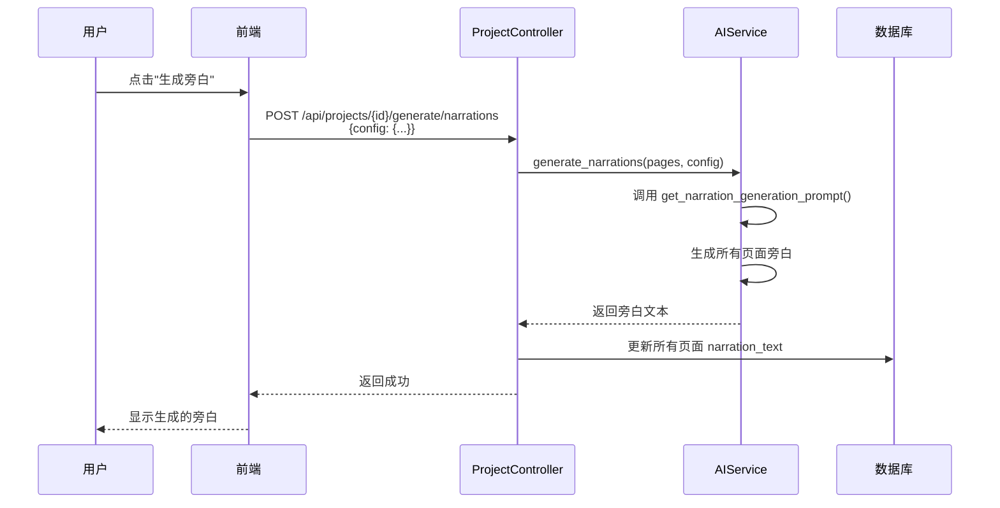
```mermaid
sequenceDiagram
    participant U as 用户
    participant F as 前端
    participant PC as ProjectController
    participant AI as AIService
    participant DB as 数据库
    
    U->>F: 点击"生成旁白"
    F->>PC: POST /api/projects/{id}/generate/narrations<br>{config: {...}}
    PC->>AI: generate_narrations(pages, config)
    AI->>AI: 调用 get_narration_generation_prompt()
    AI->>AI: 生成所有页面旁白
    AI-->>PC: 返回旁白文本
    PC->>DB: 更新所有页面 narration_text
    PC-->>F: 返回成功
    F-->>U: 显示生成的旁白
```

#### 代码位置

**前端：**
- 批量生成：[frontend/src/api/endpoints.ts:637-648](../../vendors/banana-slides/frontend/src/api/endpoints.ts#L637-L648)
- 单页生成：[frontend/src/api/endpoints.ts:621-632](../../vendors/banana-slides/frontend/src/api/endpoints.ts#L621-L632)
- 更新旁白：[frontend/src/api/endpoints.ts:606-616](../../vendors/banana-slides/frontend/src/api/endpoints.ts#L606-L616)

**后端：**
- 控制器：[backend/controllers/page_controller.py:990-1094](../../vendors/banana-slides/backend/controllers/page_controller.py#L990-L1094)

#### 提示词引用

**提示词：** `get_narration_generation_prompt()`

**关键参数：**
- 页面内容（title、points、description）
- 演讲者人设
- 目标听众
- 语调风格
- 演讲主题
- 字数范围

**提示词内容：** → 参见 [提示词章节 6.1 旁白生成提示词](02-prompts-reference.md#61-旁白生成提示词)

#### 输入输出

**批量生成请求：**
```typescript
{
  narration_config?: {
    speaker_persona: string,
    target_audience: string,
    tone_style: string,
    topic: string,
    word_count_range: [number, number]
  },
  language?: string
}
```

**响应数据：**
```typescript
{
  success: true,
  data: {
    narrations: [
      {
        page_id: string,
        narration_text: string
      }
    ]
  }
}
```

**副作用：**
- 更新所有页面的 narration_text

#### 异常处理

| 错误场景 | HTTP 状态码 | 错误信息 | 处理方式 |
|---------|------------|---------|---------|
| 页面为空 | 400 | "Project has no pages" | 提示用户先生成内容 |
| AI 生成失败 | 500 | "Failed to generate narration" | 记录错误，返回友好提示 |

---

## 3. 跨模块机制

### 3.1 任务管理系统

Banana Slides 使用 ThreadPoolExecutor 实现轻量级异步任务管理，无需 Celery/Redis。

#### 核心组件

**ResourceLimiter（资源限制器）：**

- 作用：控制并发访问外部资源（如 AI API）
- 实现：使用 `threading.Condition` 实现线程安全
- 配置：支持动态调整容量

**TaskManager（任务管理器）：**

- 作用：管理后台异步任务
- 实现：使用 `ThreadPoolExecutor` 并发执行
- 状态跟踪：通过 Task 模型跟踪任务状态

#### 任务类型

| 任务类型 | 说明 | 任务函数 |
|---------|------|---------|
| `generate_descriptions` | 批量生成描述 | `generate_descriptions_task()` |
| `generate_images` | 批量生成图片 | `generate_images_task()` |
| `edit_page_image` | 编辑页面图片 | `edit_page_image_task()` |
| `generate_material_image` | 生成素材 | `generate_material_image_task()` |
| `process_material_image` | 处理素材 | `process_material_image_task()` |
| `process_ppt_renovation` | PPT 翻新 | `process_ppt_renovation_task()` |
| `export_editable_pptx` | 导出可编辑 PPTX | `export_editable_pptx_with_recursive_analysis_task()` |
| `export_video` | 导出视频 | `export_video_task()` |

#### 典型任务流程

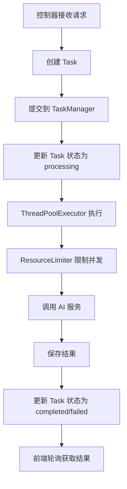
```mermaid
flowchart TD
    A[控制器接收请求] --> B[创建 Task]
    B --> C[提交到 TaskManager]
    C --> D[更新 Task 状态为 processing]
    D --> E[ThreadPoolExecutor 执行]
    E --> F[ResourceLimiter 限制并发]
    F --> G[调用 AI 服务]
    G --> H[保存结果]
    H --> I[更新 Task 状态为 completed/failed]
    I --> J[前端轮询获取结果]
```

#### 代码位置

- ResourceLimiter：[backend/services/task_manager.py:52-95](../../vendors/banana-slides/backend/services/task_manager.py#L52-L95)
- TaskManager：[backend/services/task_manager.py:98+](../../vendors/banana-slides/backend/services/task_manager.py#L98-L163)

#### 配置

**并发配置：**
```python
description_workers = 5  # 描述生成并发数
image_workers = 3        # 图片生成并发数
```

**资源限制器：**
```python
description_limiter = ResourceLimiter("Description", description_workers)
image_limiter = ResourceLimiter("Image", image_workers)
```

#### 使用示例

```python
# 控制器创建任务
task = Task(
    project_id=project_id,
    task_type='generate_images',
    status='pending'
)
db.session.add(task)
db.session.commit()

# 提交到 TaskManager
task_manager.generate_images_task(task.id)

# 前端轮询
GET /api/projects/{id}/tasks/{task_id}
```

---

### 3.2 错误处理与重试

Banana Slides 使用多层错误处理和重试机制确保稳定性。

#### 重试机制

**AI 调用重试：**

使用 `tenacity` 库自动重试：

```python
@retry(
    stop=stop_after_attempt(3),
    retry=retry_if_exception_type(APIError),
    wait=wait_exponential(multiplier=1, min=2, max=10)
)
def generate_image(...):
    pass
```

**数据库重试：**

```python
def _commit_with_retry(db):
    for i in range(5):
        try:
            db.session.commit()
            return
        except OperationalError:
            time.sleep(2 ** i)
    raise
```

#### 错误类型

| 错误类型 | 说明 | 处理方式 |
|---------|------|---------|
| APIError | AI API 调用失败 | 自动重试 3 次 |
| TimeoutError | 请求超时 | 自动重试，增加超时时间 |
| JSONParseError | JSON 解析失败 | 记录错误，返回友好提示 |
| OperationalError | 数据库操作失败 | 自动重试 5 次 |
| FileNotFoundError | 文件不存在 | 记录错误，返回 404 |

#### 错误响应格式

```json
{
  "success": false,
  "error": "错误信息描述"
}
```

#### 日志记录

所有错误都会记录到日志：
```python
import logging
logger = logging.getLogger(__name__)

try:
    # 执行操作
except Exception as e:
    logger.error(f"操作失败: {str(e)}", exc_info=True)
    raise
```

---

### 3.3 资源限制与并发控制

Banana Slides 使用 ResourceLimiter 实现细粒度的并发控制。

#### ResourceLimiter 设计

**核心机制：**

```python
class ResourceLimiter:
    def __init__(self, name: str, capacity: int):
        self.name = name
        self.capacity = capacity
        self._condition = threading.Condition()
        self._current = 0
    
    @contextmanager
    def slot(self, operation: str):
        """获取一个资源槽位"""
        with self._condition:
            while self._current >= self.capacity:
                self._condition.wait()
            self._current += 1
        
        try:
            yield
        finally:
            with self._condition:
                self._current -= 1
                self._condition.notify_all()
```

**使用示例：**

```python
# 限制图片生成并发为 3
image_limiter = ResourceLimiter("Image", 3)

# 使用限制器
with image_limiter.slot("generate_image"):
    ai_service.generate_image(...)
```

#### 并发配置

**全局配置：**

```python
# config.py
DESCRIPTION_WORKERS = 5  # 描述生成并发数
IMAGE_WORKERS = 3        # 图片生成并发数
```

**动态调整：**

```python
def sync_resource_limits():
    description_limiter.capacity = current_app.config['DESCRIPTION_WORKERS']
    image_limiter.capacity = current_app.config['IMAGE_WORKERS']
```

#### 并发策略

**分层控制：**

1. **ThreadPoolExecutor 层**：控制总体并发数
2. **ResourceLimiter 层**：控制特定资源并发数
3. **AI Provider 层**：控制 API 调用速率

**示例：**

```
ThreadPoolExecutor(max_workers=10)
  ├── DescriptionLimiter(capacity=5)
  │   ├── 5 个并发描述生成任务
  └── ImageLimiter(capacity=3)
      └── 3 个并发图片生成任务
```

#### 代码位置

- ResourceLimiter：[backend/services/task_manager.py:52-95](../../vendors/banana-slides/backend/services/task_manager.py#L52-L95)
- 配置：[backend/config.py](../../vendors/banana-slides/backend/config.py)

---

### 3.4 参考文件系统

参考文件系统允许用户上传文档，AI 参考这些文件生成内容。

#### 文件类型支持

| 文件类型 | 解析方式 | 代码位置 |
|---------|---------|---------|
| PDF | MinerU 或 PyPDF2 | [backend/services/file_service.py](../../vendors/banana-slides/backend/services/file_service.py) |
| Docx | python-docx | [backend/services/file_service.py](../../vendors/banana-slides/backend/services/file_service.py) |
| Markdown | 直接读取 | [backend/services/file_service.py](../../vendors/banana-slides/backend/services/file_service.py) |
| Txt | 直接读取 | [backend/services/file_service.py](../../vendors/banana-slides/backend/services/file_service.py) |

#### 文件处理流程

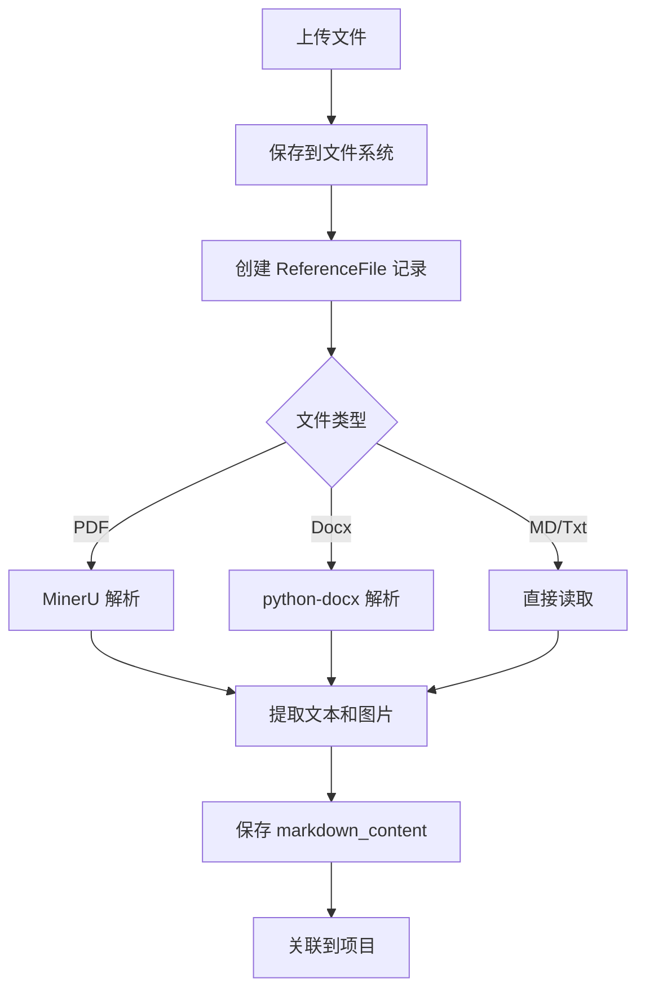
```mermaid
flowchart TD
    A[上传文件] --> B[保存到文件系统]
    B --> C[创建 ReferenceFile 记录]
    C --> D{文件类型}
    D -->|PDF| E[MinerU 解析]
    D -->|Docx| F[python-docx 解析]
    D -->|MD/Txt| G[直接读取]
    E --> H[提取文本和图片]
    F --> H
    G --> H
    H --> I[保存 markdown_content]
    I --> J[关联到项目]
```

#### 参考文件在提示词中的使用

**格式化为 XML：**

```python
def _format_reference_files_xml(reference_files_content):
    xml = "<reference_files>\n"
    for file in reference_files_content:
        xml += f"<file name='{file['filename']}'>\n"
        xml += file['markdown_content']
        xml += "</file>\n"
    xml += "</reference_files>"
    return xml
```

**添加到提示词：**

```python
prompt = f"""
用户输入：
{user_input}

{reference_files_xml}

请参考上述文件内容生成大纲。
"""
```

#### 数据模型

**ReferenceFile 模型：**

```python
class ReferenceFile(db.Model):
    id = db.Column(db.String, primary_key=True)
    project_id = db.Column(db.String, nullable=True)  # 可为 null，全局文件
    filename = db.Column(db.String, nullable=False)
    file_size = db.Column(db.Integer, nullable=False)
    file_type = db.Column(db.String, nullable=False)
    parse_status = db.Column(db.String, default='pending')
    markdown_content = db.Column(db.Text)
    error_message = db.Column(db.String)
```

#### 代码位置

- 控制器：[backend/controllers/reference_file_controller.py](../../vendors/banana-slides/backend/controllers/reference_file_controller.py)
- 文件服务：[backend/services/file_service.py](../../vendors/banana-slides/backend/services/file_service.py)
- 模型：[backend/models/reference_file.py](../../vendors/banana-slides/backend/models/reference_file.py)

---

### 3.5 AI Provider 抽象层

Banana Slides 通过 Provider 抽象层支持多个 AI 提供商。

#### Provider 架构

**抽象接口：**

```python
class TextProvider(ABC):
    @abstractmethod
    def generate_text(self, prompt: str) -> str:
        pass
    
    @abstractmethod
    def generate_json(self, prompt: str) -> Union[Dict, List]:
        pass

class ImageProvider(ABC):
    @abstractmethod
    def generate_image(self, prompt: str, image_data: bytes) -> str:
        pass
    
    @abstractmethod
    def edit_image(self, instruction: str, image: bytes, mask: bytes) -> str:
        pass
```

#### 支持的 Provider

| Provider | 说明 | 配置 |
|---------|------|------|
| **GeminiProvider** | Google Gemini | `AI_PROVIDER_FORMAT='gemini'` |
| **OpenAIProvider** | OpenAI GPT | `AI_PROVIDER_FORMAT='openai'` |
| **VertexAIProvider** | Google Vertex AI | `AI_PROVIDER_FORMAT='vertex'` |
| **LazyLLMProvider** | 国内厂商聚合 | `AI_PROVIDER_FORMAT='lazyllm'` |

#### Provider 配置

**配置项：**

```python
# config.py
AI_PROVIDER_FORMAT = 'gemini'  # 默认 Provider
TEXT_MODEL = 'gemini-2.5-pro'
IMAGE_MODEL = 'gemini-2.5-pro'
IMAGE_CAPTION_MODEL = 'gemini-2.5-flash'
```

**API Key 配置：**

```python
# Settings 模型
class Settings(db.Model):
    text_api_key = db.Column(db.String)
    image_api_key = db.Column(db.String)
    caption_api_key = db.Column(db.String)
```

#### Provider 初始化

```python
# ai_service.py
class AIService:
    def __init__(self):
        self.text_provider = get_text_provider(model=self.text_model)
        self.image_provider = get_image_provider(model=self.image_model)
        self.caption_provider = get_caption_provider(model=self.caption_model)
```

#### 推理配置

**文本推理：**

```python
ENABLE_TEXT_REASONING = False
TEXT_THINKING_BUDGET = 1024
```

**图像推理：**

```python
ENABLE_IMAGE_REASONING = False
IMAGE_THINKING_BUDGET = 1024
```

#### 代码位置

- Provider 抽象：[backend/services/ai_providers/](../../vendors/banana-slides/backend/services/ai_providers/)
- AI 服务：[backend/services/ai_service.py](../../vendors/banana-slides/backend/services/ai_service.py)

---

## 附录

### A. 术语表

| 术语 | 说明 |
|-----|------|
| **ProjectContext** | 项目上下文对象，包含项目创建时的所有信息 |
| **creation_type** | 创作类型：idea（想法）/ outline（大纲）/ descriptions（描述） |
| **reference_files** | 参考文件，用于为 AI 提供额外上下文 |
| **Page** | 页面对象，代表 PPT 的一页 |
| **Material** | 素材对象，图片等资源 |
| **Task** | 异步任务对象 |
| **ResourceLimiter** | 资源限制器，控制并发访问 |
| **SSE** | Server-Sent Events，服务端推送事件 |
| **Vibe 式交互** | 自然语言交互方式 |

### B. 关键文件索引

| 文件路径 | 说明 |
|---------|------|
| [backend/services/prompts.py](../../vendors/banana-slides/backend/services/prompts.py) | 所有提示词定义 |
| [backend/services/ai_service.py](../../vendors/banana-slides/backend/services/ai_service.py) | AI 服务核心逻辑 |
| [backend/services/task_manager.py](../../vendors/banana-slides/backend/services/task_manager.py) | 异步任务管理 |
| [backend/controllers/project_controller.py](../../vendors/banana-slides/backend/controllers/project_controller.py) | 项目相关 API |
| [backend/controllers/page_controller.py](../../vendors/banana-slides/backend/controllers/page_controller.py) | 页面相关 API |
| [backend/controllers/export_controller.py](../../vendors/banana-slides/backend/controllers/export_controller.py) | 导出相关 API |
| [frontend/src/api/endpoints.ts](../../vendors/banana-slides/frontend/src/api/endpoints.ts) | 前端 API 定义 |

### C. 参考章节

- **提示词详细说明** → 参见 [02-prompts-reference.md](02-prompts-reference.md)
- **架构图** → 参见 [diagrams/architecture-diagrams.md](diagrams/architecture-diagrams.md)
- **阶段一总结** → 参见 [notes/stage-one-summary.md](notes/stage-one-summary.md)

---

**文档版本**：1.0  
**最后更新**：2025-06-15  
**状态**：✅ 完成
