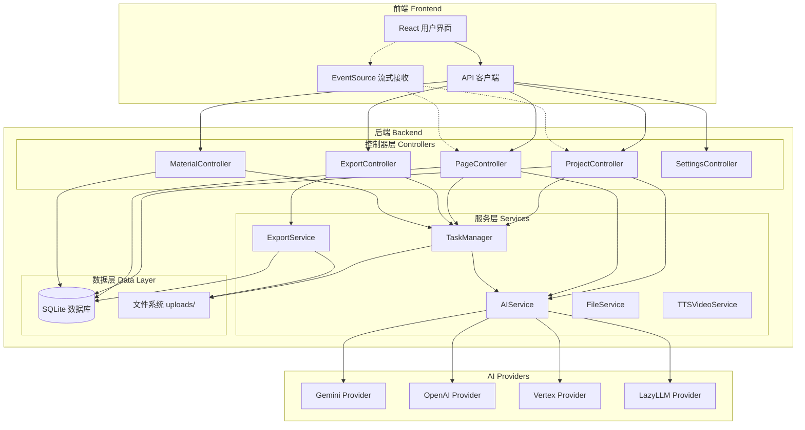
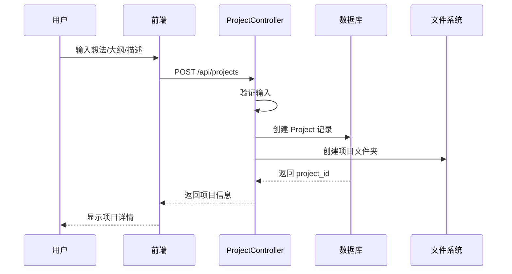
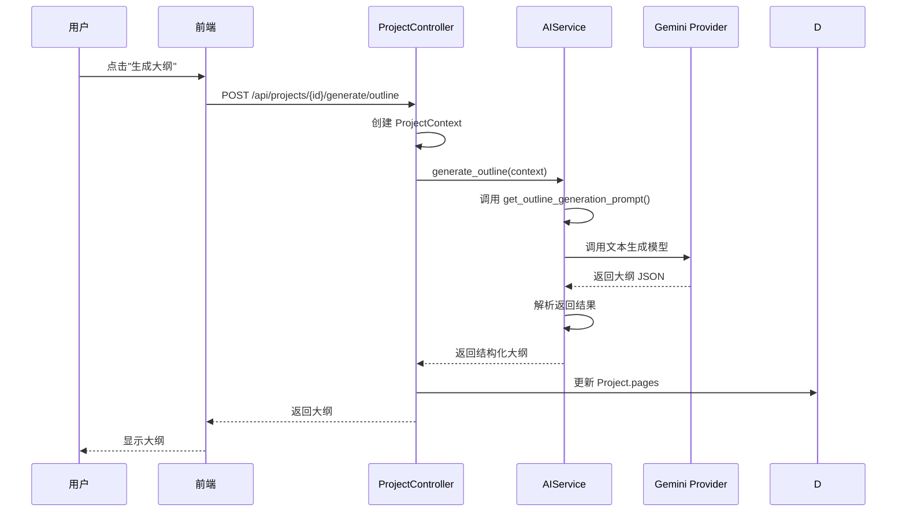
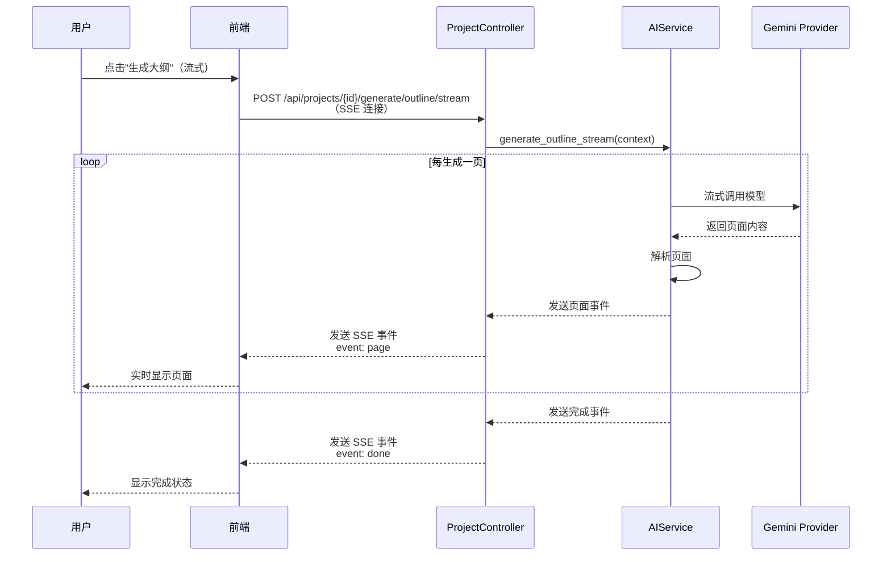
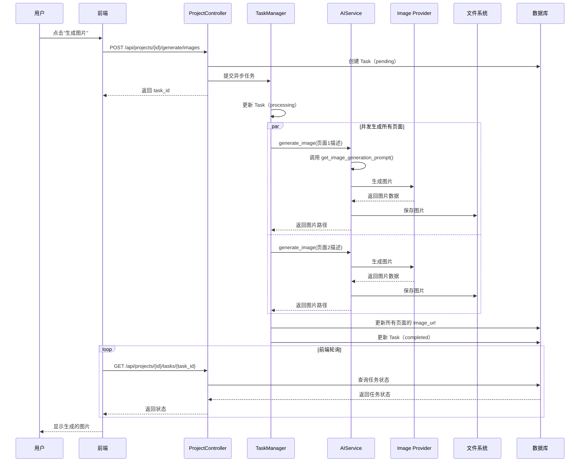
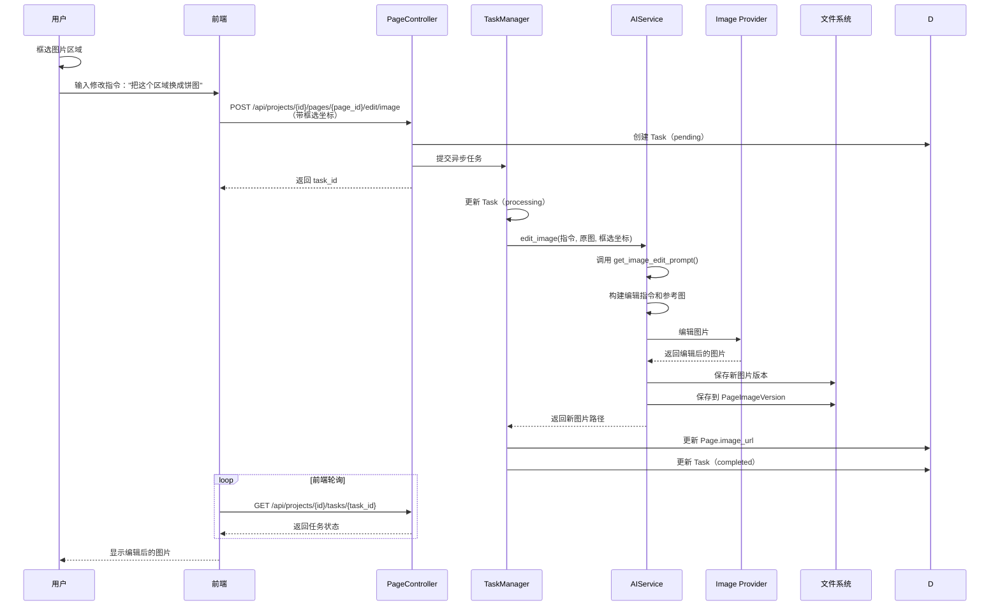
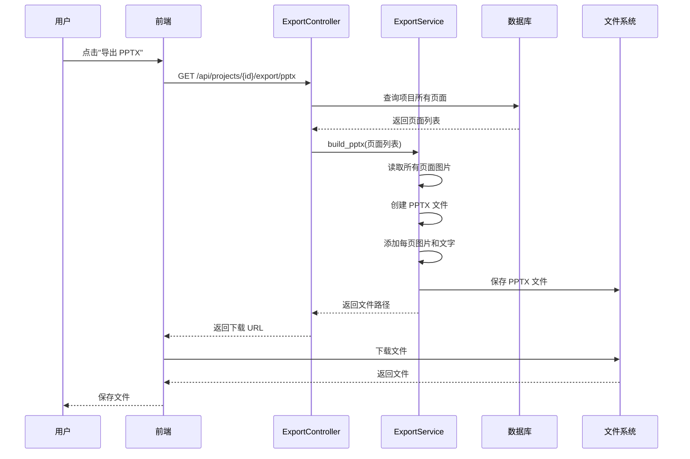
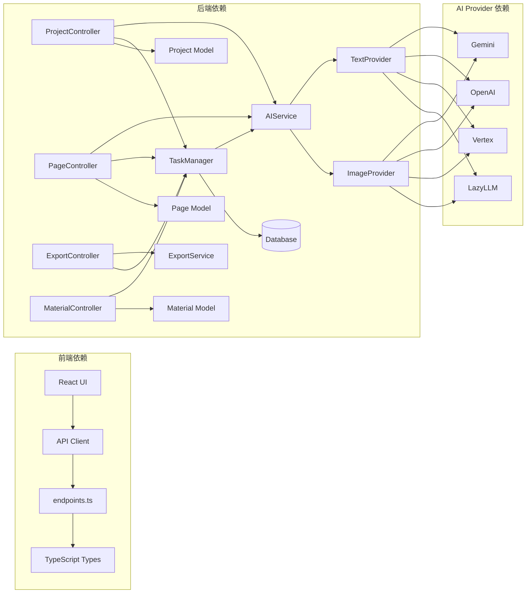
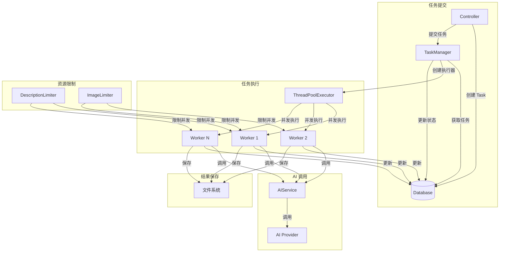
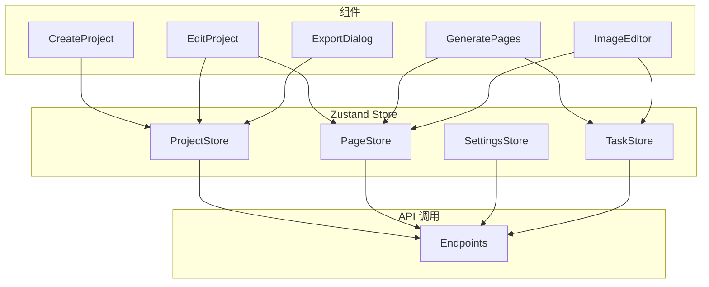

# Banana Slides 系统架构图

## 1. 总体架构

---

## 2. 数据流向：创建项目

---

## 3. 数据流向：生成大纲

---

## 4. 数据流向：流式生成大纲（SSE）

---

## 5. 数据流向：生成图片

---

## 6. 数据流向：Vibe 式图片编辑

---

## 7. 数据流向：导出 PPTX

---

## 8. 模块依赖关系

---

## 9. 任务管理系统架构

---

## 10. 前端状态管理

---

## 架构说明

### 技术栈

**前端**：
- React 18
- TypeScript
- Vite 5
- Zustand（状态管理）
- TailwindCSS

**后端**：
- Python 3.10+
- Flask 3.0
- SQLAlchemy
- ThreadPoolExecutor

**AI Provider**：
- Gemini（Google）
- OpenAI
- Vertex AI
- LazyLLM

**数据存储**：
- SQLite（数据库）
- 文件系统（uploads/）

### 设计模式

1. **Provider 模式**：抽象不同的 AI Provider
2. **Context 模式**：统一管理项目上下文
3. **Task 模式**：异步任务管理
4. **Stream 模式**：流式生成（SSE）

### 核心流程

1. **创作流程**：想法 → 大纲 → 描述 → 图片
2. **编辑流程**：自然语言修改 → AI 处理 → 版本保存
3. **导出流程**：读取数据 → 生成文件 → 下载
4. **任务流程**：创建 Task → 异步执行 → 状态查询
