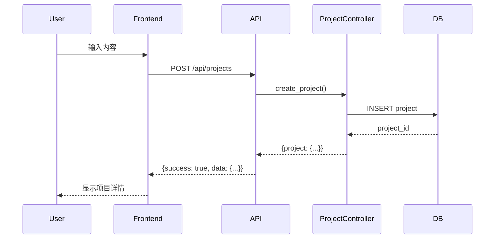
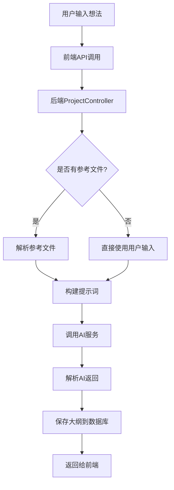

# Banana Slides 功能执行流程与提示词文档需求规格

## 1. 文档概述

### 1.1 文档定位
本文档是 Banana Slides 项目的 **System Logic & Prompt Engineering Documentation**（系统逻辑与提示词工程文档），旨在帮助开发者、学习者和贡献者深入理解项目的核心工作原理和 AI 提示词策略。

### 1.2 文档目标
- **理解系统工作原理**：梳理从前端 UI 到后端服务再到 AI 模型的完整数据流
- **掌握提示词工程**：记录各环节使用的 AI 提示词模板及其设计思路
- **支持二次开发**：提供清晰的代码-文档映射，便于定位和修改功能
- **促进知识传承**：为项目维护者和新加入的开发者提供完整的技术文档

### 1.3 目标读者
| 读者角色 | 阅读目的 | 预期收益 |
|---------|---------|---------|
| **开发者** | 二次开发、功能扩展 | 理解架构、定位代码、修改提示词 |
| **AI 研究者** | 研究提示词工程 | 学习 AI PPT 生成的提示词设计策略 |
| **项目维护者** | 问题排查、版本迭代 | 快速定位问题、理解业务逻辑 |
| **技术写作者** | 编写用户文档 | 理解功能原理，撰写准确的使用说明 |

---

## 2. 文档结构

本文档分为两大部分：

### 2.1 第一部分：功能执行流程
以**用户操作流程**为主线，逐步展开系统的工作原理。

#### 目录结构
```
1. 项目概述
   1.1 技术架构总览
   1.2 核心模块说明
   1.3 数据流向概览

2. 核心功能流程
   2.1 项目创建流程
   2.2 大纲生成流程
   2.3 页面描述生成流程
   2.4 图片生成流程
   2.5 图片编辑流程（Vibe式修改）
   2.6 文件解析流程（PDF/Docx等）
   2.7 导出流程（PPTX/PDF/视频）
   2.8 素材管理流程
   2.9 PPT翻新流程
   2.10 旁白生成流程

3. 跨模块机制
   3.1 任务管理系统
   3.2 错误处理与重试
   3.3 资源限制与并发控制
   3.4 参考文件系统
   3.5 AI Provider 抽象层
```

### 2.2 第二部分：提示词工程
按**功能域**分类整理所有提示词，并提供使用示例和设计说明。

#### 目录结构
```
1. 提示词总览
   1.1 提示词分类体系
   1.2 共享组件与常量
   1.3 语言配置机制

2. 大纲提示词（Outline Prompts）
   2.1 大纲生成提示词
   2.2 大纲解析提示词
   2.3 描述转大纲提示词
   2.4 大纲细化提示词

3. 描述提示词（Description Prompts）
   3.1 单页描述生成提示词
   3.2 批量描述生成提示词
   3.3 描述拆分提示词
   3.4 描述细化提示词

4. 图片生成提示词（Image Generation Prompts）
   4.1 文生图提示词
   4.2 图片编辑提示词
   4.3 背景清理提示词
   4.4 画质修复提示词

5. 内容提取提示词（Content Extraction Prompts）
   5.1 文字属性提取提示词
   5.2 页面内容提取提示词
   5.3 排版分析提示词
   5.4 风格提取提示词

6. 旁白提示词（Narration Prompts）
   6.1 旁白生成提示词
   6.2 旁白配置说明

附录
   A. 提示词函数索引
   B. 提示词模板变量说明
   C. 提示词版本历史
```

---

## 3. 内容要求

### 3.1 功能执行流程章节规范

每个功能流程必须包含以下要素：

#### 3.1.1 流程概述
- **用户视角**：用户在前端看到的操作步骤
- **系统视角**：后端涉及的核心组件
- **数据流图**：用 Mermaid 流程图展示数据流转过程

示例格式：
```markdown
### 2.1 项目创建流程

#### 用户操作
1. 用户在首页选择创作方式（想法/大纲/描述）
2. 输入相应内容
3. 选择模板风格和图片比例
4. 点击"创建项目"

#### 系统处理
- 前端调用 `createProject` API
- 后端 `project_controller` 处理请求
- 数据库创建项目记录
- 返回项目信息给前端

#### 数据流图

```

#### 3.1.2 核心代码定位
- **前端文件**：关键组件和 API 调用位置
- **后端文件**：控制器、服务、模型位置
- **代码引用格式**：使用 `[filename.ts:line](filename.ts#Lline)` 格式

示例格式：
```markdown
#### 代码位置

**前端：**
- API 定义：[frontend/src/api/endpoints.ts:24-42](frontend/src/api/endpoints.ts#L24-L42)
- 创建表单：[frontend/src/components/CreateProjectForm.tsx](frontend/src/components/CreateProjectForm.tsx)

**后端：**
- 控制器：[backend/controllers/project_controller.py:45-80](backend/controllers/project_controller.py#L45-L80)
- 模型：[backend/models/project.py](backend/models/project.py)
- 路由注册：[backend/app.py:29](backend/app.py#L29)
```

#### 3.1.3 提示词引用
- 在流程中**首次出现提示词调用**时添加引用
- 引用格式：`→ 参见 [提示词章节 2.1 大纲生成提示词](#21-大纲生成提示词)`
- 提供提示词的关键参数说明

示例格式：
```markdown
#### AI 调用

大纲生成阶段会调用 AI 服务生成 PPT 大纲。

**提示词：** `get_outline_generation_prompt()`

**关键参数：**
- `project_context.creation_type`：创作类型（idea/outline/descriptions）
- `project_context.idea_prompt`：用户输入的想法
- `language`：输出语言（zh/ja/en/auto）

**提示词内容：** → 参见 [提示词章节 2.1 大纲生成提示词](#21-大纲生成提示词)
```

#### 3.1.4 输入输出说明
- **输入**：API 请求参数格式
- **输出**：API 响应格式
- **副作用**：数据库变更、文件生成等

示例格式：
```markdown
#### 输入输出

**请求参数：**
```typescript
{
  creation_type: 'idea' | 'outline' | 'descriptions',
  idea_prompt?: string,
  outline_text?: string,
  description_text?: string,
  template_style?: string,
  image_aspect_ratio?: string
}
```

**响应数据：**
```typescript
{
  success: true,
  data: {
    project: {
      id: string,
      creation_type: string,
      pages: [],
      created_at: string
    }
  }
}
```

**副作用：**
- 数据库插入新项目记录
- 创建项目文件夹：`uploads/{project_id}/`
```

#### 3.1.5 异常处理
- **常见错误**：用户可能遇到的错误情况
- **处理方式**：系统如何处理这些错误
- **用户提示**：向用户展示的错误信息

示例格式：
```markdown
#### 异常处理

| 错误场景 | HTTP 状态码 | 错误信息 | 处理方式 |
|---------|------------|---------|---------|
| API Key 未配置 | 500 | "AI service not properly configured" | 前端提示用户检查设置 |
| AI 超时 | 504 | "AI request timeout" | 自动重试3次 |
| 输入内容为空 | 400 | "Content cannot be empty" | 前端表单验证 |
```

### 3.2 提示词章节规范

每个提示词条目必须包含以下要素：

#### 3.2.1 提示词元信息
- **函数名**：代码中的函数名
- **所属模块**：属于哪个功能域
- **调用位置**：在代码中的调用位置
- **AI 模型**：使用的 AI 模型（文本/图像）

示例格式：
```markdown
### 2.1 大纲生成提示词

#### 元信息
- **函数名**：`get_outline_generation_prompt()`
- **所属模块**：大纲生成
- **代码位置**：[backend/services/prompts.py:280-301](backend/services/prompts.py#L280-L301)
- **AI 模型**：文本生成模型（gemini-2.5-pro / gpt-4o 等）
- **调用位置**：[backend/services/ai_service.py:xxx](backend/services/ai_service.py#Lxxx)
```

#### 3.2.2 提示词模板
- **完整模板**：展示提示词的完整内容
- **变量说明**：解释模板中的变量占位符
- **示例调用**：展示实际调用时的参数和生成的提示词

示例格式：
```markdown
#### 提示词模板

```python
# 基础模板
prompt = f"""
你是一个专业的 PPT 大纲设计师。根据用户的{creation_type}，生成一个清晰、有逻辑的 PPT 大纲。

{original_input}

{language_instruction}

{format_spec}

{extra_fields_instruction}
"""
```

#### 变量说明

| 变量名 | 类型 | 说明 | 示例值 |
|-------|------|------|-------|
| `creation_type` | string | 创作类型 | 'idea', 'outline', 'descriptions' |
| `original_input` | string | 用户原始输入 | "生成一个关于人工智能的PPT" |
| `language_instruction` | string | 语言指令 | "请使用全中文输出。" |
| `format_spec` | string | 格式规范 | JSON 格式规范 |
| `extra_fields_instruction` | string | 额外字段指令 | 额外的字段要求 |

#### 示例调用

**输入参数：**
```python
project_context = ProjectContext(
    creation_type='idea',
    idea_prompt='生成一个关于人工智能的PPT'
)
language = 'zh'
```

**生成的提示词：**
```
你是一个专业的 PPT 大纲设计师。根据用户的idea，生成一个清晰、有逻辑的 PPT 大纲。

用户输入的想法：
生成一个关于人工智能的PPT

请使用全中文输出。

输出格式为 JSON...
```
```

#### 3.2.3 设计思路说明
- **设计目标**：该提示词要达到什么效果
- **关键要素**：提示词中包含的关键指令
- **设计考量**：为什么这样设计（如避免幻觉、确保格式等）

示例格式：
```markdown
#### 设计思路

**设计目标：**
- 将用户的自由想法转化为结构化的 PPT 大纲
- 确保大纲逻辑清晰、层次分明
- 支持中英日三种语言输出

**关键要素：**
1. **角色定位**："专业的 PPT 大纲设计师" - 赋予 AI 明确的角色身份
2. **格式约束**：严格的 JSON 格式规范 - 确保输出可解析
3. **语言指令**：明确的输出语言要求 - 支持国际化
4. **逻辑引导**：强调"清晰、有逻辑" - 提升大纲质量

**设计考量：**
- 为什么使用 JSON 格式：便于程序解析，避免自然语言格式的不确定性
- 为什么强调"逻辑"：避免 AI 生成跳跃性、无关联的页面
- 为什么提供 Part 结构：支持长 PPT 的章节划分，提升可读性
```

#### 3.2.4 相关提示词
- **关联提示词**：与该提示词相关的其他提示词
- **调用关系**：该提示词被哪些函数调用
- **变体提示词**：该提示词的变体或替代版本

示例格式：
```markdown
#### 相关提示词

**关联提示词：**
- [2.2 大纲解析提示词](#22-大纲解析提示词)：解析 AI 返回的大纲 JSON
- [2.4 大纲细化提示词](#24-大纲细化提示词)：根据用户要求修改大纲

**调用关系：**
```
get_outline_generation_prompt()
  └─> AI Service.generate_outline()
      └─> get_outline_parsing_prompt()  # 解析 AI 返回结果
```

**变体提示词：**
- `get_outline_generation_prompt_markdown()`：使用 Markdown 格式的版本
```

### 3.3 图表与可视化要求

#### 3.3.1 流程图
- 使用 Mermaid 语法绘制
- 包含关键组件和数据流向
- 标注异步操作和并行任务

示例格式：
```markdown

```

#### 3.3.2 架构图
- 使用 Mermaid 或 ASCII 图
- 展示模块间的依赖关系
- 标注关键数据流

#### 3.3.3 时序图
- 展示异步操作的时间顺序
- 标注超时和重试机制

### 3.4 代码引用规范

#### 3.4.1 引用格式
- 使用 `[filename:line](path#Lline)` 格式
- 优先链接到具体行号
- 大段代码使用代码块展示

#### 3.4.2 代码展示原则
- **展示关键逻辑**：只展示核心代码，不是全文复制
- **添加注释**：对代码添加必要的说明注释
- **标注省略**：用 `// ...` 标注省略的代码

示例格式：
```markdown
#### 核心代码

```python
# backend/services/ai_service.py:125-145
def generate_outline(project_context: ProjectContext, language: str = None):
    """
    生成 PPT 大纲
    
    Args:
        project_context: 项目上下文信息
        language: 输出语言 (zh/ja/en/auto)
    
    Returns:
        dict: 包含生成的大纲和元数据
    """
    # 1. 构建提示词
    prompt = get_outline_generation_prompt(project_context, language)
    
    # 2. 调用 AI 模型
    response = call_text_model(prompt)
    
    # 3. 解析返回结果
    outline = parse_outline_response(response)
    
    # 4. 返回结构化大纲
    return {
        'outline': outline,
        'pages': convert_to_pages(outline)
    }
    # ... 错误处理代码省略
```
```

---

## 4. 文档编写流程

### 4.1 资料收集阶段
1. **阅读核心代码**
   - [backend/services/prompts.py](backend/services/prompts.py) - 提示词定义
   - [backend/services/ai_service.py](backend/services/ai_service.py) - AI 服务
   - [backend/services/task_manager.py](backend/services/task_manager.py) - 任务管理
   - [backend/controllers/](backend/controllers/) - 各功能控制器
   - [frontend/src/api/endpoints.ts](frontend/src/api/endpoints.ts) - 前端 API

2. **理解数据模型**
   - [backend/models/project.py](backend/models/project.py)
   - [backend/models/page.py](backend/models/page.py)
   - [backend/models/material.py](backend/models/material.py)

3. **梳理业务流程**
   - 通过 README.md 了解功能概览
   - 通过测试代码理解预期行为
   - 通过日志分析实际执行流程

### 4.2 结构设计阶段
1. **设计章节目录**
   - 按功能域划分章节
   - 确保章节间逻辑清晰
   - 添加交叉引用

2. **设计图表**
   - 绘制架构总览图
   - 绘制关键流程图
   - 绘制数据流图

### 4.3 内容撰写阶段
1. **撰写功能流程**
   - 按用户视角描述
   - 添加代码引用
   - 添加提示词引用
   - 绘制流程图

2. **整理提示词**
   - 按功能域分类
   - 补充设计思路
   - 添加示例
   - 标注相关提示词

### 4.4 审核优化阶段
1. **准确性审核**
   - 核对代码引用是否正确
   - 核对提示词是否完整
   - 核对流程描述是否准确

2. **可读性优化**
   - 添加必要的示例
   - 优化图表展示
   - 统一术语和格式

3. **完整性检查**
   - 检查是否覆盖所有核心功能
   - 检查是否有遗漏的提示词
   - 检查交叉引用是否完整

---

## 5. 文档交付物

### 5.1 主文档
- **文件路径**：`docs/banana-slides/` 目录下
- **文件结构**：
  - `index.md` - 文档索引页
  - `01-functional-flows.md` - 功能执行流程（第一部分）
  - `02-prompts-reference.md` - 提示词参考（第二部分）
  - `03-architecture.md` - 架构总览（可选）

### 5.2 辅助资源
- **流程图源文件**：`diagrams/` 目录（Mermaid 源文件）
- **代码片段**：提取的关键代码片段
- **测试数据**：示例输入输出数据

### 5.3 文档示例

#### 示例：功能流程章节
```markdown
# 2. 核心功能流程

## 2.1 项目创建流程

### 用户操作
用户在前端首页选择创作方式，输入内容后创建项目。

### 系统处理

#### 前端流程
1. 用户在 [CreateProjectForm](frontend/src/components/CreateProjectForm.tsx) 中输入内容
2. 前端根据输入类型确定 `creation_type`
3. 调用 [createProject API](frontend/src/api/endpoints.ts#L24-L42)

#### 后端流程
1. [ProjectController.create_project()](backend/controllers/project_controller.py#L45-L80) 接收请求
2. 验证输入参数
3. 创建 [Project](backend/models/project.py) 记录
4. 返回项目信息

### 数据流图
```mermaid
sequenceDiagram
    ...
```

### 代码位置
- 前端：[frontend/src/api/endpoints.ts:24-42](frontend/src/api/endpoints.ts#L24-L42)
- 后端：[backend/controllers/project_controller.py:45-80](backend/controllers/project_controller.py#L45-L80)

### 提示词引用
项目创建本身不涉及 AI 调用，后续的**大纲生成**会使用：
→ 参见 [提示词章节 2.1 大纲生成提示词](02-prompts-reference.md#21-大纲生成提示词)
```

#### 示例：提示词章节
```markdown
# 2. 大纲提示词（Outline Prompts）

## 2.1 大纲生成提示词

### 元信息
- **函数名**：`get_outline_generation_prompt()`
- **所属模块**：大纲生成
- **代码位置**：[backend/services/prompts.py:280-301](backend/services/prompts.py#L280-L301)
- **AI 模型**：文本生成模型
- **调用位置**：[backend/services/ai_service.py:xxx](backend/services/ai_service.py#Lxxx)

### 提示词模板
```python
def get_outline_generation_prompt(project_context: 'ProjectContext', language: str = None) -> str:
    """构建大纲生成的提示词"""
    
    # 获取原始用户输入
    original_input = _get_original_input(project_context)
    
    # 获取语言指令
    lang_instruction = get_language_instruction(language)
    
    # 构建完整提示词
    prompt = f"""...
"""
    return _build_prompt(prompt, project_context.reference_files, tag='outline')
```

### 设计思路
...

### 相关提示词
- [2.2 大纲解析提示词](#22-大纲解析提示词)
- [2.4 大纲细化提示词](#24-大纲细化提示词)

### 使用示例
...
```

---

## 6. 质量标准

### 6.1 准确性标准
- ✅ 所有代码引用可点击且指向正确位置
- ✅ 提示词内容与代码中完全一致
- ✅ 流程描述符合实际执行逻辑
- ✅ 数据流向与代码实现一致

### 6.2 完整性标准
- ✅ 覆盖所有核心功能流程
- ✅ 包含所有提示词函数
- ✅ 每个提示词都有设计思路说明
- ✅ 每个流程都有输入输出说明

### 6.3 可读性标准
- ✅ 使用清晰的语言和术语
- ✅ 提供足够的示例和图表
- ✅ 章节结构清晰，易于导航
- ✅ 交叉引用完整，便于跳转

### 6.4 实用性标准
- ✅ 读者能通过文档理解系统原理
- ✅ 开发者能快速定位代码位置
- ✅ AI 研究者能学习提示词设计
- ✅ 维护者能基于文档进行修改

---

## 7. 附录

### 7.1 术语表
| 术语 | 说明 |
|-----|------|
| ProjectContext | 项目上下文对象，包含项目创建时的所有信息 |
| creation_type | 创作类型：idea（想法）/ outline（大纲）/ descriptions（描述） |
| reference_files | 参考文件，用于为 AI 提供额外上下文 |
| Page | 页面对象，代表 PPT 的一页 |
| Material | 素材对象，图片等资源 |
| Task | 异步任务对象 |

### 7.2 关键文件索引
| 文件路径 | 说明 |
|---------|------|
| backend/services/prompts.py | 所有提示词定义 |
| backend/services/ai_service.py | AI 服务核心逻辑 |
| backend/services/task_manager.py | 异步任务管理 |
| backend/controllers/project_controller.py | 项目相关 API |
| backend/controllers/page_controller.py | 页面相关 API |
| backend/controllers/export_controller.py | 导出相关 API |
| frontend/src/api/endpoints.ts | 前端 API 定义 |

### 7.3 参考资料
- [Banana Slides README](../vendors/banana-slides/README.md)
- [Banana Slides 官方文档](https://docs.bananaslides.online/)
- [nano banana pro 模型文档](https://ai.google.dev/gemini-api/docs)

---

## 变更历史

| 版本 | 日期 | 变更说明 | 作者 |
|-----|------|---------|------|
| 0.1 | 2025-06-15 | 初始版本，定义需求规格 | - |

---

**文档状态**：✅ 需求规格已定义，等待开始撰写正式文档
